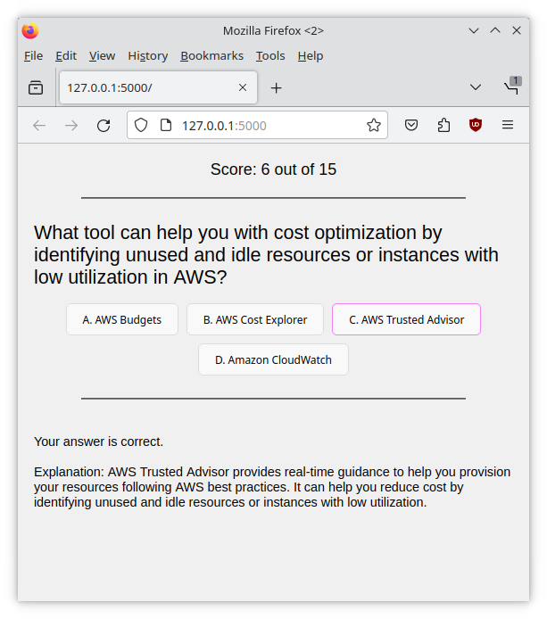

# Quiz Application for AWS Certification Preparation

## Intent

This quiz application was developed as a tool to assist in testing and improving my learning progress, particularly for AWS Certification preparation. It offers an interactive way to engage with questions, enhancing the study experience.  
The answers were generated using GPT4.


## How to Run

To run the application, follow these steps:

1. **Install Python**: Ensure you have Python installed on your machine. If not, download and install it from [python.org](https://www.python.org/).

2. **Set Up a Virtual Environment** (Optional but recommended):
   - Navigate to the project directory in the terminal.
   - Run `python -m venv venv` to create a virtual environment.
   - Activate the environment:
     - Windows: `venv\Scripts\activate`
     - macOS/Linux: `source venv/bin/activate`

3. **Install Dependencies**:
   - Ensure `pip` is up to date: `pip install --upgrade pip`
   - Install required packages: `pip install Flask`

4. **Run the Flask Application**:
   - In the project directory, run `flask run`.
   - The application will start on `http://127.0.0.1:5000`.

## How to Use

- **Open in Browser**: Navigate to `http://127.0.0.1:5000` in your web browser to start using the quiz.
- **Interaction**: You can interact with the quiz using either your mouse to select options or keyboard keys (A, S, D, F) for corresponding answers.
- **Feedback**: After each answer, immediate feedback and an explanation are provided, and the next question will be loaded automatically.

# Project structure:
```
/quiz-app
|-- app.py
|-- requirements.txt
|-- /templates
    |-- index.html
|-- /static
    |-- style.css
    |-- script.js
|-- questions.txt
```

## Author

- Marcel Petrick
- Email: [mail@marcelpetrick.it](mailto:mail@marcelpetrick.it)

## License

This project is licensed under the GNU General Public License v3.0 - see the [LICENSE](LICENSE) file for details.
