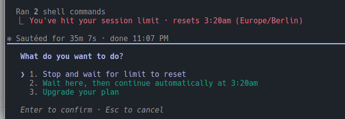

# Agent Budget Watch

`agent-watch` is a conservative Linux utility that watches Codex CLI and Claude
Code sessions in KDE Konsole. It reports provider quota health and can resume a
blocked session after usage becomes available again—only when the terminal,
process identity, prompt, quota source, and configured policy all agree.

The current target is Manjaro/Arch Linux, KDE Plasma, Konsole, Wayland or X11,
and Python 3.11 or newer. Runtime code uses only the Python standard library.



This real prompt is deliberately fail-closed. Agent Watch detects the limit and
reset time, but never selects “continue automatically” or “upgrade your plan.”
Claude is resumed only from its explicit `press enter to continue` prompt.

## Install

From this directory, use `pipx` so the CLI is isolated while remaining available
at `~/.local/bin/agent-watch`:

```bash
pipx install .
agent-watch --version
agent-watch doctor
```

For development:

```bash
python3 -m pip install --user -e '.[dev]'
scripts/quality.sh
```

## See what is running

```bash
agent-watch status
agent-watch quota
```

`status` classifies visible Konsole sessions. `quota` is read-only and reports
provider availability, failures, usage percentages, and the reset time for each
known window:

```text
Claude pts/4 PID 769257
  availability: EXHAUSTED
  source:       claude-statusline
  session       100.0%  reset 03:20
```

Provider state and terminal state are intentionally separate. A quota may be
available while a terminal is active, or a terminal may show an old limit while
provider data is unavailable. Unknown or stale quota data never authorizes input.

## Watch sessions

Start with observe mode. It runs the complete detection path but cannot type:

```bash
agent-watch run --observe --all
```

Other modes are:

```bash
agent-watch run --ask       # select sessions and confirm each action
agent-watch run --auto      # select sessions; resume only policy-approved prompts
agent-watch simulate --all  # exercise the built-in danger scenarios
```

Claude continuation is a bare Enter only when Claude explicitly asks for it.
Codex has no equivalent affordance, so Codex auto-resume remains disabled unless
`ALLOW_CODEX_AUTO_RESUME=true` is intentionally configured. Model downgrades,
paid credits, purchases, upgrades, and reset-credit redemption are never enabled
by the supplied configuration.

Create and inspect the default configuration with:

```bash
agent-watch init
agent-watch config
```

The file is `~/.config/agent-watch/config`. It is parsed as data and never
sourced as shell code. Logs and state live under
`~/.local/state/agent-watch/`; terminal contents are not logged.

## Claude quota bridge

The bridge is the supplied `scripts/claude-statusline-proxy.sh`, not another
package, daemon, plugin, or network service. Claude Code exposes quota data only
to its configured status-line command. The bridge receives that JSON, copies
only the usage windows and reset timestamps to Agent Watch's state directory,
and then runs your existing status line with the original JSON.

Without it, `agent-watch quota` honestly reports Claude as `UNKNOWN` with
`no-statusline-file`. Prompt detection still works, but automatic mode will not
guess that quota is available.

Install the one supplied file:

```bash
install -Dm755 scripts/claude-statusline-proxy.sh \
  ~/.local/share/agent-watch/claude-statusline-proxy.sh
```

Configure it as Claude's `statusLine` command in `~/.claude/settings.json`:

```json
{
  "statusLine": {
    "type": "command",
    "command": "~/.local/share/agent-watch/claude-statusline-proxy.sh"
  }
}
```

If a status line already exists, preserve it through
`AGENT_WATCH_STATUSLINE_CHAIN`:

```json
{
  "statusLine": {
    "type": "command",
    "command": "AGENT_WATCH_STATUSLINE_CHAIN=~/.claude/my-statusline.sh ~/.local/share/agent-watch/claude-statusline-proxy.sh"
  }
}
```

For example, if the current command is
`~/.claude/abtop-combined-statusline.sh`, the replacement is:

```json
{
  "statusLine": {
    "type": "command",
    "command": "AGENT_WATCH_STATUSLINE_CHAIN=~/.claude/abtop-combined-statusline.sh ~/.local/share/agent-watch/claude-statusline-proxy.sh"
  }
}
```

Restart Claude Code if it does not reload the setting, wait for one status-line
render, then verify the bridge without enabling automation:

```bash
agent-watch quota
ls -l ~/.local/state/agent-watch/quota/claude.json
```

The bridge writes an owner-only, atomically replaced quota document at
`~/.local/state/agent-watch/quota/claude.json`. Failures do not prevent the
existing status line from running.

## Background service

Install the supplied user service from this checkout:

```bash
scripts/install-user-service.sh
systemctl --user enable --now agent-watch.service
systemctl --user status agent-watch.service
```

The shipped service is observe-only. It may discover new agent tabs, but it can
never send input. After validating `doctor`, `quota`, observe mode, and the
simulations, auto mode can be explicitly enabled with:

```bash
systemctl --user edit agent-watch.service
```

```ini
[Service]
ExecStart=
ExecStart=%h/.local/bin/agent-watch run --auto --all --no-fzf
```

Then run `systemctl --user restart agent-watch.service`. Remove the service with
`scripts/install-user-service.sh --uninstall`.

## Safety model

Immediately before any input, Agent Watch re-reads and verifies:

- the explicitly selected Konsole session;
- PID, process start time, TTY, and provider classification;
- a current, known prompt and its permitted action;
- fresh provider quota with no other exhausted window;
- the persisted prompt fingerprint and retry budget.

SSH, containers, tmux/screen, unknown prompts, stale quota, provider errors,
process replacement, and paid or quality-changing choices all fail closed. A
single-instance lock and persisted `PLANNED -> SENT -> VERIFIED|FAILED` action
lifecycle prevent duplicate input across concurrent processes and crashes.

See [vision.md](vision.md) for product intent and [PLAN.md](PLAN.md) for the
original implementation sequence.

## Development and release

```bash
scripts/quality.sh
python3 -m pytest -m konsole  # set AGENT_WATCH_LIVE_KONSOLE=1 for the live test
```

Release tags use `agentwhiletrue-vX.Y.Z`. The project follows semantic
versioning while major version zero denotes an alpha interface.

## License

This subproject is covered by the repository's GNU General Public License v3.
