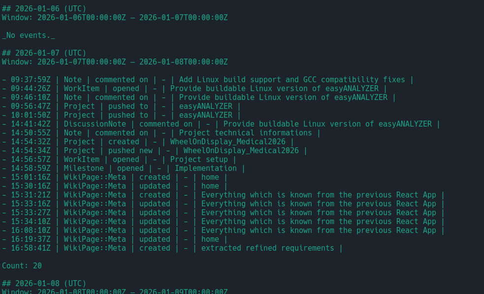

## What


---------------

Example calls

Milestone URL (your “new idea” flow):

export GITLAB_URL="https://git.example.com"
export GITLAB_TOKEN="...PAT..."

python3 main.py \
  --milestone-url "https://git.example.com/group/project/-/milestones/12" \
  --output burndown.png


Explicit project + milestone IID:

python3 main.py \
  --project "group/project" \
  --milestone-iid 12 \
  --output burndown.png


Bigger/smaller output:

python3 main.py \
  --milestone-url "https://git.data-modul.com/research/wheelondisplay_medical2026/-/milestones/1" \
  --output burndown_4k.png \
  --width 3840 --height 2160 --dpi 200

---------------
    ~/repos/codingWithGPT/Gitlab_Burndown    master ⇡2 *6 !2  python3 main.py \                                                                                                                     ✔  6s   Gitlab_Burndown  
  --milestone-url "https://git.data-modul.com/research/wheelondisplay_medical2026/-/milestones/1" \
  --output burndown_4k.png \
  --width 3840 --height 2160 --dpi 200 --verbose

[info] Project: research/wheelondisplay_medical2026
[info] Milestone: iid=1 — Implementation
[info] Issues fetched: 13
[info] Base URL: https://git.data-modul.com
[info] Horizon: 2026-01-09 → 2026-01-27 (UTC dates)
project: research/wheelondisplay_medical2026
milestone: 1 — Implementation
horizon_utc: 2026-01-09 .. 2026-01-27 (inclusive)
issues: 13
estimated_hours_end: 122.00
spent_hours_end:     52.00
remaining_hours_end: 70.00
png: burndown_4k.png
    ~/repos/codingWithGPT/Gitlab_Burndown    master ⇡2 *6 !2     

---------------

Create a **daily, UTC-aligned overview of a GitLab user’s activity stream** (events) for a given time window.
The script fetches all activities for a user (default: the authenticated user), buckets them into **1-day blocks (00:00–24:00 UTC)**, and prints the result to **stdout** in an LLM-friendly format or structured JSON.

This is designed as a **data extraction stage**: collect, normalize, and chunk activity data so it can be processed later (e.g. summarized by a Large Language Model).

No admin permissions are required; the script works entirely within the scope of the authenticated user.

---

## Virtual environment setup

```bash
python3 -m venv .venv
source .venv/bin/activate
python3 -m pip install -r requirements.txt
```

---

## Example call

Default behavior (current user, last 10 days, Markdown output):

```bash
python main.py --base-url https://git.example.com
```

Explicit user and explicit time window:

```bash
python main.py \
  --base-url https://git.example.com \
  --user mpetrick \
  --start 2026-01-01T00:00:00Z \
  --end   2026-01-11T00:00:00Z \
  --format llm-md
```

JSON output for downstream processing:

```bash
python main.py \
  --base-url https://git.example.com \
  --format json > activity.json
```

---

## Result

Example (excerpt, `--format llm-md`):

```text
# GitLab Activity Stream (Daily Buckets)

- User: mpetrick (Marcel Petrick)
- Host: https://git.example.com
- Window (UTC): 2026-01-01T00:00:00Z — 2026-01-11T00:00:00Z

## 2026-01-09 (UTC)
Window: 2026-01-09T00:00:00Z — 2026-01-10T00:00:00Z

- 09:14:32Z | MergeRequest | opened | group/project | Add caching to API | https://…
- 11:02:10Z | Issue        | commented | group/project | Flaky test on CI | https://…

Count: 2
```

Each day is emitted as a clearly delimited block, making it straightforward to feed intoAG (retrieval-augmented generation) or summarization pipelines.



---

## Notes & tips

* **Auth**:
  Create a Personal Access Token with at least the `read_api` scope.
  Pass it via `--token` or the `GITLAB_TOKEN` environment variable (recommended).

* **User scope**:

  * Default: activity of the authenticated user.
  * Use `--user <username>` to fetch events for another user (must be visible to you).

* **Time window**:

  * Use `--start` / `--end` (ISO-8601, UTC recommended).
  * If omitted, the script defaults to **last 10 days ending now (UTC)**.
  * All bucketing is done strictly in **UTC**.

* **Output formats**:

  * `--format llm-md` (default): Markdown, optimized for LLM ingestion.
  * `--format json`: Stable structured schema for piping to tools like `jq` or custom post-processing.

* **Rate limits**:
  The script paginates through the GitLab Events API and stops early once events fall outside the requested window. A simple heartbeat option is included for slow instances.

* **Non-admin usage**:
  Works without admin rights; only accesses events visible to the authenticated user.

---

## Copyright
GPLv3; mail@marcelpetrick.it; zero warranty

