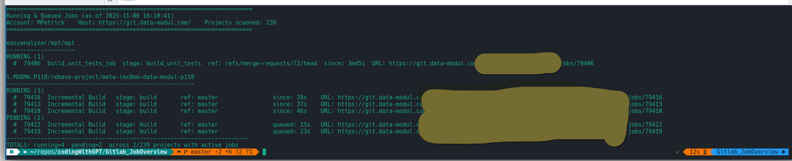

# GitLab Job Overview

Show currently running and pending GitLab CI jobs across projects available to
a non-administrator account.

## Setup

Create a Personal Access Token with at least the `read_api` scope, then install
the exactly pinned runtime dependencies:

```bash
python3 -m venv .venv
.venv/bin/python -m pip install -r requirements.txt
export GITLAB_TOKEN="<token>"
```

Set `GITLAB_URL` as well or pass `--base-url` on each invocation.

## Usage

```bash
.venv/bin/python main.py \
  --base-url https://git.example.com \
  --format table \
  --concurrency 8 \
  --progress
```

Example progress output:

```text
Found 1337 projects to scan (concurrency=8)
[1/1337] scanning example-group/example-project …
[1/1337] ✓ example-group/example-project: running=0 pending=1
```

Useful options:

- `--projects "group/project another/project"` resolves only those projects
  instead of enumerating every membership.
- `--max-projects N` limits a full scan for quick checks.
- `--include-archived` includes archived projects in addition to active ones.
- `--format table|json|csv` selects human-readable or machine-readable output.
- `--heartbeat-secs 0` disables the periodic heartbeat.
- `--verbose` reports authentication, discovery, and project-level failures.

## Performance

The script requests running and pending jobs together, so a full scan normally
uses one Jobs API request per project rather than two. Full project discovery
requests compact records, while `--projects` bypasses membership enumeration.

The default concurrency is eight. Higher values such as 16, 24, or 32 may be
faster on a self-managed instance, but should be benchmarked with
`--max-projects` because server capacity and rate limits differ. For the lowest
terminal overhead, omit `--progress` and rely on the heartbeat.

`python-gitlab` automatically honors `429` responses and the server's
`Retry-After` header. Projects that still fail are counted in table output and
reported on standard error.

## Output

- `--format table` groups jobs by project and status.
- `--format json` emits a stable object schema suitable for `jq`.
- `--format csv` emits spreadsheet-friendly columns.

Successful runs end with the elapsed wall-clock duration. It is written to
standard output for tables and standard error for JSON or CSV so
machine-readable output remains valid.

If GitLab does not return `queued_duration`, pending duration is calculated
from `created_at`.



## Tests

```bash
.venv/bin/python -m unittest discover -s tests -v
.venv/bin/python -m pip check
```

## Copyright

GPLv3; mail@marcelpetrick.it; zero warranty
