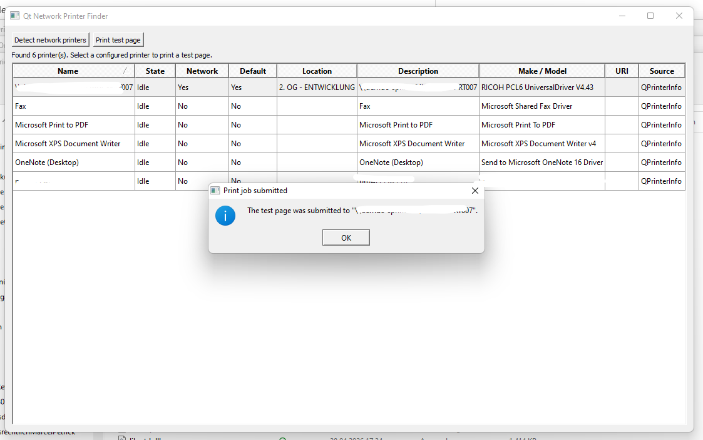

# Qt Printer Finder Example

This is a Qt 5.15 C++ desktop application that discovers printers and lets the user submit a simple test page to a selected configured printer. It builds on Linux and Windows with CMake.

## Quick Start

Build and run natively on Linux:

```sh
cmake -S . -B build -DCMAKE_BUILD_TYPE=Release
cmake --build build
./build/QtPrinterFinderExample
```

The UI provides:

- A **Detect network printers** button.
- A table of discovered printers with name, state, network/default flags, location, description, model, URI, and source.
- A **Print test page** button for printers that are configured as system print queues.

Discovery combines multiple sources:

- `QPrinterInfo::availablePrinterNames()` and `QPrinterInfo::printerInfo(name)` for printers available through the operating system. This is the portable path used on both Windows and Linux.
- A QtNetwork mDNS/DNS-SD probe for `_ipp._tcp.local` and `_ipps._tcp.local`, which is the common advertisement mechanism for network IPP/AirPrint printers on Windows and Linux networks.
- On Linux/Unix only, `lpstat -v` for CUPS queue URIs when CUPS is available.

Qt can reliably print to configured system queues. On Windows, `QPrinterInfo` reports printers known to Windows, including configured network printers. On Linux, CUPS queues are also queried for device URIs. DNS-SD-only printers are listed so the user can see network-advertised devices, but they must be added to the operating system or CUPS before Qt can submit a print job to them.


## Current state when cross-built with MXE on Linux for Windows 11:



## Requirements

- CMake 3.16 or newer.
- A C++17 compiler.
- Qt 5.15 with the `Widgets`, `PrintSupport`, `Network`, and `Concurrent` modules.
- Optional on Linux: CUPS command-line tools (`lpstat`) for configured queue details.

## Build

From the repository root:

```sh
cmake -S . -B build -DCMAKE_BUILD_TYPE=Release
cmake --build build
```

If Qt is installed in a custom location, point CMake at it:

```sh
cmake -S . -B build -DCMAKE_PREFIX_PATH=/path/to/Qt/5.15/gcc_64 -DCMAKE_BUILD_TYPE=Release
cmake --build build
```

## Run

```sh
./build/QtPrinterFinderExample
```

Press **Detect network printers** to populate the table. Select an installed printer and press **Print test page** to submit a simple Qt-rendered test page.

## Windows Cross-Build

This repository includes a MinGW/Qt 5 toolchain file and verification script for building a Windows 11 executable from Linux:

```sh
sudo ./setup-windows-toolchain.sh
```

After the toolchain exists, rebuild and redeploy the Windows app with:

```sh
MXE_PREFIX=/opt/mxe \
WINDOWS_MINGW_TRIPLET=x86_64-w64-mingw32.shared \
WINDOWS_MINGW_BIN=/opt/mxe/usr/bin \
./scripts/verify-windows-toolchain.sh
```

The Windows deployment bundle is created in:

```text
dist/windows
```

Copy the complete `dist/windows` directory to Windows, not only the `.exe`. The folder contains the application, Qt DLLs, MinGW runtime DLLs, Qt plugins such as `platforms/qwindows.dll` and `printsupport/windowsprintersupport.dll`, and transitive dependencies such as OpenSSL, zlib, ICU, and PCRE.

See [docs/windows-crosscompile.md](docs/windows-crosscompile.md) for the required Windows-target Qt prefix, MXE environment variables, build commands, and deployment bundle details.

## Platform Notes

`QPrinterInfo` is the cross-platform API used by the app. It exposes printer name, description, location, make/model, state, default status, and whether the printer is remote/networked. Qt recommends using `availablePrinterNames()` and then resolving individual printers with `printerInfo(name)`, because creating full printer info objects for every printer can take time when remote printers are involved.

There is no single Qt 5.15 API that guarantees discovery of every possible printer on a LAN across Windows and Linux. This application therefore uses the portable system printer list everywhere and augments it with a cross-platform mDNS/DNS-SD probe for IPP/IPPS printers.

On Linux, installing CUPS client tools improves configured queue details:

Manjaro/Arch:

```sh
sudo pacman -S --needed cups
```

Debian/Ubuntu:

```sh
sudo apt install cups-client
```

Package names vary by distribution.

## Known Limitations

DNS-SD discovery can list advertised IPP/IPPS network printers, but Qt can only submit print jobs to printers configured as operating-system print queues. Add a discovered printer to Windows or CUPS before using **Print test page**.

## Troubleshooting

If Windows reports a missing DLL, regenerate the deployment bundle and copy the full folder again:

```sh
MXE_PREFIX=/opt/mxe \
WINDOWS_MINGW_TRIPLET=x86_64-w64-mingw32.shared \
WINDOWS_MINGW_BIN=/opt/mxe/usr/bin \
./scripts/verify-windows-toolchain.sh
```

Generated directories can be deleted and rebuilt:

```sh
rm -rf build build-win dist
```

## Author

Marcel Petrick <mail@marcelpetrick.it>

## License

GPLv3. See [LICENSE](LICENSE) for license terms.
