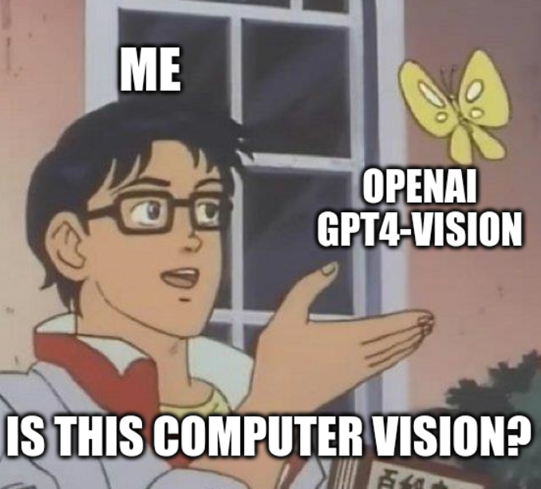

# Sales Slip Sum Extractor



## Why?
I'm a lazy person. I don't want to type in the sum of my grocery shopping manually. I want to take a picture of the sales slip and let the computer do the work for me.  
Just kidding. The goal was to see how well OpenAI's GPT-3 can handle OCR tasks. And it's doing a great job!  
To be honest: using the OpenAI API is overkill for such a task. Because a simple OCR library like Tesseract would be sufficient.  
I spent 1 hour of time (quite good return of investment) for the development and 15 cent for OpenAI's API-usage.

## Overview
This Python 3 application is designed to automate the extraction of payment totals from sales slips. It leverages OpenAI's advanced computer vision capabilities to scan, identify, and interpret the total amount paid on German sales slips for groceries or gas. This project represents an efficient and innovative approach to processing sales slips, utilizing AI to extract critical financial information.

## Prerequisites
* Python 3.x
* OpenAI API Key (charge your billing up front!)
* An internet connection for API requests

## Setup
* Clone the repository to your local machine.
* Install the necessary dependencies by running: `pip install -r requirements.txt` from the command line in the project directory.
* Set your OpenAI API key as an environment variable: `export OPENAI_API_KEY='your_api_key_here'`
* Place the images you want to process in the `test_images` directory. 

## Usage
To use the application, execute the following command in your terminal from the project directory:
```bash
python salesSlipScanner.py
```

## Output
The program processes each image file in the specified directory, resizing the image, converting it to a base64-encoded string, and then sending it to OpenAI for analysis. The expected output for each processed image is printed to the console in the following format:
```
File: path_to_image.jpg, Content: extracted_sum
```
For example:
```
File: test_images/slip2_1093.jpg, Content: 10,93
File: test_images/slip0_7949.jpg, Content: 79,49
File: test_images/slip1_2841.jpg, Content: 28,41
```
As the interested reader may have noticed, the given file-names state the expected sum in the image. This is to allow for a quick check of the program's accuracy. Yes, this is not covered by unit-tests ;)

## License
GPL-3.0 License

## Author
Marcel Petrick - mail@marcelpetrick.it
