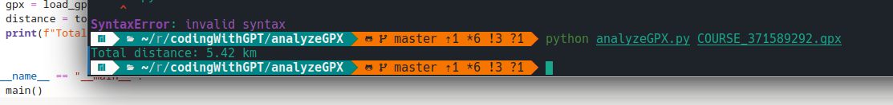

# README.md

## GPX Distance Analyzer

A concise CLI tool to compute accurate 2‑D distance from GPX tracks using WGS‑84 geodesic math.

---

## Features

* **Accurate** – geodesic distance via `geopy`
* **Simple** – pass your `.gpx` as a positional argument
* **Ready to extend** – add outlier pruning or 3‑D support

---

## Installation

```bash
python3 -m venv .venv
source .venv/bin/activate
pip install -r requirements.txt
```

---

## Usage

```bash
python analyzeGpx.py COURSE_371589292.gpx
```

Example output:

```
Total distance: 4.97 km
```

---

## Input

* Standard `.gpx` files with `<trk>/<trkseg>/<trkpt>`
* Multi‑segment tracks supported

---

## Screenshot



---

## License

GPLv3 (c) 2025 [mail@marcelpetrick.it](mailto:mail@marcelpetrick.it)

Contributions welcome!
