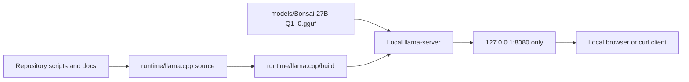
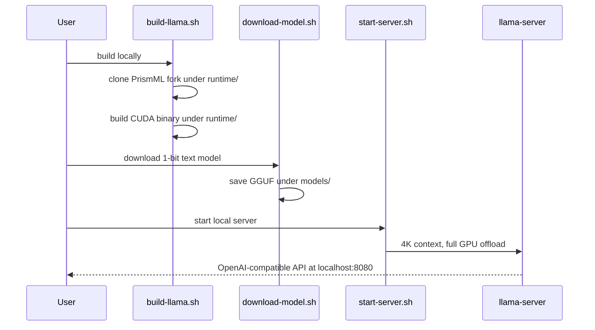

# Local-only workflow

## Safety boundary

All mutable runtime state is kept under the repository root. The scripts do not call `sudo`, package managers, `pip install`, or `systemctl`; they neither install nor modify host services. The only external actions are a git clone into `runtime/` and the model download into `models/`.



## Runtime sequence



## Initial configuration

The initial server configuration is intentionally conservative:

- Model: `Bonsai-27B-Q1_0.gguf` only; no vision projection or speculative drafter.
- Context: 4096 tokens.
- GPU: request full layer offload (`-ngl 99`).
- Binding: `127.0.0.1` only.
- GPU budget: the vendor model card reports about 5.2 GB peak memory at 4K context for the 1-bit language model. Check actual usage on this RTX A2000 8 GB GPU before increasing context.

## Validation and troubleshooting

`check-server.sh` sends a short chat completion to the local API and prints the result. While the server runs, inspect GPU use with:

```sh
nvidia-smi
```

If startup fails with an out-of-memory error, first close GPU-heavy programs and retry. Do not increase context, add vision, or add the drafter until a 4K text-only session succeeds. All generated state may be removed safely with `rm -rf runtime models logs`; this removes only repository-local artifacts.
