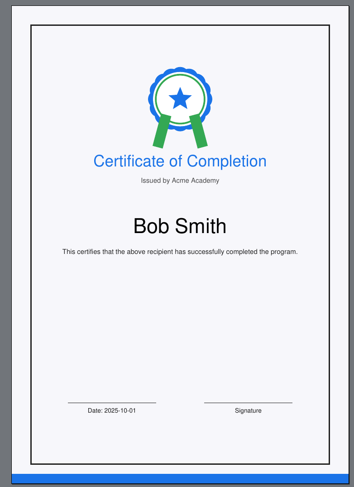

# Certificate Generator

This project provides a Python script to generate **A4 PDF certificates** for a list of recipients.
It reads data (title, issuer, names, colors, etc.) from an INI configuration file and produces one certificate PDF per person.

---

## Features

- Generates certificates in **A4 format** (595×842 pt).
- Reads config from a simple **INI file**.
- **One PDF per recipient** with their name automatically inserted.
- Draws a **stylized vector logo** (no external images needed).
- Customizable **colors, title, subtitle, issuer, date**.
- Optional support for **Unicode fonts** (e.g., names with accents).



---

## Requirements

- Python 3.10+
- Dependencies:
  ```bash
  python3 -m venv .venv                                                                                                                                                   ✔  certificateGenerator  
  source .venv/bin/activate
  pip install -r requirements.txt
  ```

(Optional) For full Unicode support, place a `DejaVuSans.ttf` font file in the same directory as the script.

---

## Files

- **generate_certificates.py** — main script.
- **config.ini** — example configuration file.
- **output/** — directory where generated PDFs are stored.

---

## Example Configuration (`config.ini`)

```ini
[certificate]
title = Certificate of Completion
subtitle = Advanced Python Track
issuer = Acme Academy
date = 2025-10-01

[design]
primary_color = #1a73e8
accent_color = #34a853
border_color = #222222
background_tint = #f7f7fb

[recipients]
names =
    Alice Johnson
    Bob Smith
    Charlie Müller
    D’Andre Lewis

[output]
directory = output
```

---

## Usage

1. Place `main.py` and `config.ini` in the same folder.
2. (Optional) Add `DejaVuSans.ttf` for full Unicode character support.
3. Run the script:
   ```bash
   python main.py config.ini
   ```
4. Certificates will be generated in the `output/` directory.

---

## Example Output

- `Certificate - Alice Johnson.pdf`
- `Certificate - Bob Smith.pdf`
- `Certificate - Charlie Müller.pdf`
- `Certificate - D’Andre Lewis.pdf`

---

## License

GPLv3. Feel free to use and modify.  
Author: mail@marcelpetrick.it
