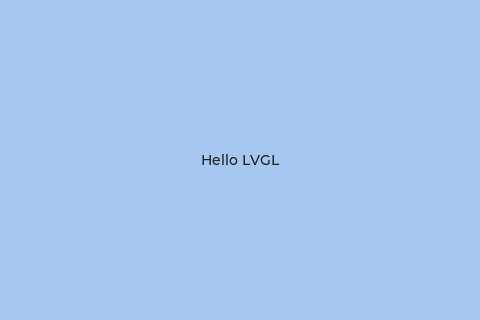

<!--
SPDX-FileCopyrightText: 2026 Marcel Petrick

SPDX-License-Identifier: GPL-3.0-or-later
-->

# CMake FetchContent instead of a Git submodule: a minimal LVGL demo

[](https://github.com/marcelpetrick/codingWithGPT/actions/workflows/cmakeFetchContentVersusGitSubmodule.yml)

This is a minimal LVGL/CMake demonstration of one idea:

- **LVGL is not a Git submodule.** There is no `.gitmodules` file and no copy of LVGL in this repository.
- **CMake fetches LVGL during configure**, with the plain `FetchContent` module that ships with CMake.
- **The fetched source lives in the build tree** (`build/_deps/lvgl-src`), not in the source tree.
- **GitHub Actions proves the same behavior in CI**: a clean fetch and build, then a tag switch in the same build directory.

The demo program opens a 480×320 window with a blue background and one centered label. The window is only there to prove that LVGL was not just downloaded: it was configured, compiled, linked and used.



> Clone one normal GitHub repository, run CMake, and CMake obtains LVGL itself. Change the requested LVGL tag and rerun CMake; CMake updates the dependency checkout. No Git submodule is needed.

| File | Role |
| --- | --- |
| [`CMakeLists.txt`](CMakeLists.txt) | The whole dependency story. `FetchContent_Declare()` is in this file, not in a helper module. |
| [`lv_conf.h`](lv_conf.h) | LVGL configuration: 32-bit color and the SDL display driver, nothing else. |
| [`src/main.cpp`](src/main.cpp) | The demo: `lv_init()`, one SDL window, a blue background, one label, the LVGL timer loop. |
| [`../.github/workflows/cmakeFetchContentVersusGitSubmodule.yml`](../.github/workflows/cmakeFetchContentVersusGitSubmodule.yml) | CI. It sits at the repository root because GitHub only runs workflows from there. |
| [`fetchcontent_lvgl_project_spec.md`](fetchcontent_lvgl_project_spec.md) | The original vision and requirements for this project. |

## Prerequisites

- Git
- CMake 3.28 or newer
- A C and C++ compiler (C++17)
- The SDL2 development package, which provides the desktop window
- Ninja (recommended; any CMake generator works)
- Network access when configuring: the first configure clones LVGL from GitHub, and a tag switch fetches from it

LVGL itself is not a prerequisite. CMake fetches it.

On Ubuntu:

```bash
sudo apt-get update
sudo apt-get install -y build-essential cmake ninja-build libsdl2-dev
```

## Clone, configure, build, run

This project lives in the `codingWithGPT` collection repository. A plain clone is enough; no `--recursive`, no `git submodule update`.

```bash
git clone https://github.com/marcelpetrick/codingWithGPT.git
cd codingWithGPT/cmakeFetchContentVersusGitSubmodule
cmake -S . -B build -G Ninja
cmake --build build
./build/hello_lvgl
```

The first configure (`cmake -S . -B build -G Ninja`) is where the dependency arrives. `FetchContent` clones LVGL at the requested tag into CMake's dependency area in the build tree:

```text
build/_deps/lvgl-src      the LVGL checkout (a normal Git clone, owned by CMake)
build/_deps/lvgl-build    LVGL's build output
build/_deps/lvgl-subbuild the helper project CMake uses to run the clone
```

`build/` is ignored by Git, so none of this ever lands in the repository. Closing the window ends the program.

To watch the clone happen, configure with `-DFETCHCONTENT_QUIET=OFF`. The log then contains the Git output, including:

```text
-- LVGL FetchContent revision: v9.5.0
-- Populating lvgl
Cloning into 'lvgl-src'...
HEAD is now at 85aa60d18 chore: release v9.5.0 (#9753)
```

## How the CMake part works

The dependency section of [`CMakeLists.txt`](CMakeLists.txt) is the core of the project (shortened here; the full file is under 60 lines):

```cmake
include(FetchContent)

if(NOT DEFINED LVGL_GIT_TAG)
    set(LVGL_GIT_TAG "v9.5.0")
endif()

FetchContent_Declare(
    lvgl
    GIT_REPOSITORY https://github.com/lvgl/lvgl.git
    GIT_TAG        ${LVGL_GIT_TAG}
    GIT_PROGRESS   TRUE
)

# ... LVGL's build switches as cache entries, explained below ...

message(STATUS "LVGL FetchContent revision: ${LVGL_GIT_TAG}")
FetchContent_MakeAvailable(lvgl)
```

- **`FetchContent_Declare()`** only records where LVGL comes from and which revision is wanted.
- **`FetchContent_MakeAvailable()`** does the work during configure: it clones LVGL on the first run, moves the checkout to another tag when `LVGL_GIT_TAG` changes, and then adds LVGL's own `CMakeLists.txt` with `add_subdirectory()`. From then on LVGL's targets are part of this build.
- **The application links `lvgl::lvgl`**, the target LVGL's CMake exports. No LVGL sources are listed by hand and no include path is hard-coded; the target carries them.
- **SDL2 comes from the system** through `find_package(SDL2)`. It is linked to the `lvgl` target, because LVGL's SDL driver is compiled inside it. SDL2 is a host prerequisite, not a second fetched dependency.
- **LVGL's build switches are set as cache entries** before `FetchContent_MakeAvailable()`: the path to `lv_conf.h`, and examples, demos and the bundled ThorVG turned off. LVGL declares these as cache options under an older CMake policy level, which discards a plain variable of the same name on the very first configure. With plain `set()` calls the first configure ignored the given `lv_conf.h` path and enabled all three extras.

The defaults are deliberate:

- **A release tag, not a branch.** `master` would change under your feet. A tag is readable and makes switching releases easy to show. Tags can in principle be moved upstream; a production project that needs strict reproducibility may prefer a full commit hash in `GIT_TAG`.
- **No `GIT_SHALLOW`.** A full clone keeps the whole history, so a tag switch is a `git fetch` plus a checkout inside the existing clone, whichever release you move to.
- **No `FETCHCONTENT_UPDATES_DISCONNECTED` or `FETCHCONTENT_FULLY_DISCONNECTED`.** Either would stop CMake from updating the checkout, and updating it is what this project shows.

## Changing the LVGL tag

Rerun configure in the **same** build directory with another tag, then build:

```bash
cmake -S . -B build -DLVGL_GIT_TAG=v9.4.0
cmake --build build
```

What happens:

1. This reruns the configure step in the existing build directory.
2. CMake sees that the requested revision of the declared dependency changed.
3. `FetchContent` updates the existing checkout in `build/_deps/lvgl-src`: it fetches from the remote (tags can move) and checks out the new tag. It is not cloned again.
4. The build recompiles LVGL and relinks the demo.

No `git submodule update`, and no Git command of your own, is involved. With `-DFETCHCONTENT_QUIET=OFF` the switch is visible in the log:

```text
-- LVGL FetchContent revision: v9.4.0
-- Fetching latest from the remote origin
Previous HEAD position was 85aa60d18 chore: release v9.5.0 (#9753)
HEAD is now at c016f72d4 chore: release v9.4.0 (#9075)
```

Switch back the same way:

```bash
cmake -S . -B build -DLVGL_GIT_TAG=v9.5.0
cmake --build build
```

To see which revision CMake checked out, a read-only Git query is enough:

```bash
git -C build/_deps/lvgl-src describe --tags
```

## CMake cache behavior: `-D` persists, `-U` removes

A value given with `-DLVGL_GIT_TAG=...` is stored in `build/CMakeCache.txt`. It stays there for every later configure of that build directory and keeps overriding the default in `CMakeLists.txt` until you change or remove it.

| You want to... | Run |
| --- | --- |
| Use another release | `cmake -S . -B build -DLVGL_GIT_TAG=v9.4.0` |
| Drop the override and go back to the default in `CMakeLists.txt` | `cmake -S . -B build -U LVGL_GIT_TAG` |
| Pick up a new default you edited in `CMakeLists.txt` (no `-D` override cached) | `cmake -S . -B build` |

If you edit the default in `CMakeLists.txt` and nothing changes, a cached override is still active: `grep LVGL_GIT_TAG build/CMakeCache.txt` shows it, and `-U LVGL_GIT_TAG` removes it.

Deleting the build directory is a valid clean reset when something is broken, but it is **not** how the dependency gets updated. The commands above are.

```bash
rm -rf build
cmake -S . -B build -G Ninja
```

To build without network access, point `FetchContent` at an existing LVGL checkout. It is then used as is, without cloning or updating, so `LVGL_GIT_TAG` has no effect; the checkout's own revision is what gets built:

```bash
cmake -S . -B build -G Ninja -DFETCHCONTENT_SOURCE_DIR_LVGL=/path/to/lvgl
```

## Why this is not a submodule

```text
Git submodule:
Git owns dependency checkout state in the source tree.

FetchContent:
CMake owns dependency population for the build tree.
```

With a submodule, the superproject records a commit of the dependency, the checkout lives in the source tree, and every clone needs `--recursive` or `git submodule update --init`. Updating means a Git operation and a commit in the superproject.

With `FetchContent`, the revision is a line in `CMakeLists.txt`, the checkout lives in the build tree, and a normal clone is enough. Updating means changing a tag and rerunning configure.

This project picks the second model because LVGL is a pure build dependency here and the goal is that a normal clone is sufficient. Neither model is better in general. A submodule is the right choice when you want to edit the dependency inside your source tree, commit against it, or have the source already present after cloning with no network at configure time. `FetchContent` needs network access on the first configure and on every tag switch (or a local checkout passed with `FETCHCONTENT_SOURCE_DIR_LVGL`), and each build directory holds its own copy.

## What CI proves

[The workflow](../.github/workflows/cmakeFetchContentVersusGitSubmodule.yml) runs on `ubuntu-latest` for every push and pull request that touches this project, and on demand from the Actions tab:

1. Checks out the repository with `submodules: false` and confirms there is no `.gitmodules` and no tracked LVGL source.
2. Installs only `libsdl2-dev` and `ninja-build`. LVGL is not installed.
3. **Configures a clean build directory with the default tag.** This is where CMake fetches LVGL.
4. Verifies with a read-only `git rev-parse` that `build/_deps/lvgl-src` is exactly at the default tag.
5. Builds the demo against the fetched LVGL.
6. **Reconfigures the same build directory with `-DLVGL_GIT_TAG=v9.4.0`** and verifies that `FetchContent` moved the checkout to that tag.
7. Builds the demo against the switched release.
8. **Reconfigures with `-U LVGL_GIT_TAG`** and verifies the checkout is back on the default tag.

Git is never used to clone, fetch or check out LVGL; CMake does all of that. No `build/` or `_deps/` cache is kept between runs, because a warm cache would hide the first fetch. The job summary lists the requested tag and the checked-out commit after each configure. The runner has no display, so CI stops at building; the window above is the visible proof.

## Tested with

Both LVGL tags, v9.5.0 (default) and v9.4.0, build without a single compiler or CMake warning on:

| Environment | CMake | Compiler | SDL2 |
| --- | --- | --- | --- |
| Manjaro Linux (local, window checked on screen) | 4.4.3 | GCC 16.2.1 | 2.32.72 (sdl2-compat) |
| GitHub `ubuntu-latest` runner (Ubuntu 24.04) | 3.31.6 | GCC 13.3.0 | 2.30.0 |

The CI job usually takes about a minute and a half: the LVGL clone during the first configure takes about 20 s, a full build about 20 s. A slow Ubuntu package mirror can stretch the `apt-get` step from seconds to a few minutes. The minimum stated in `CMakeLists.txt` is CMake 3.28.

## Scope

On purpose, this is not a production LVGL application, an embedded port, an LVGL feature tour, or a package-manager comparison. The demo stays at one window and one label so that the dependency handling is the only thing worth reading.

## License

GPL-3.0-or-later, see the repository's [`LICENSE`](../LICENSE). LVGL is fetched at configure time and is licensed separately under the MIT license.
