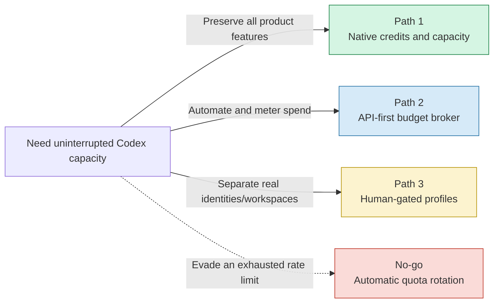
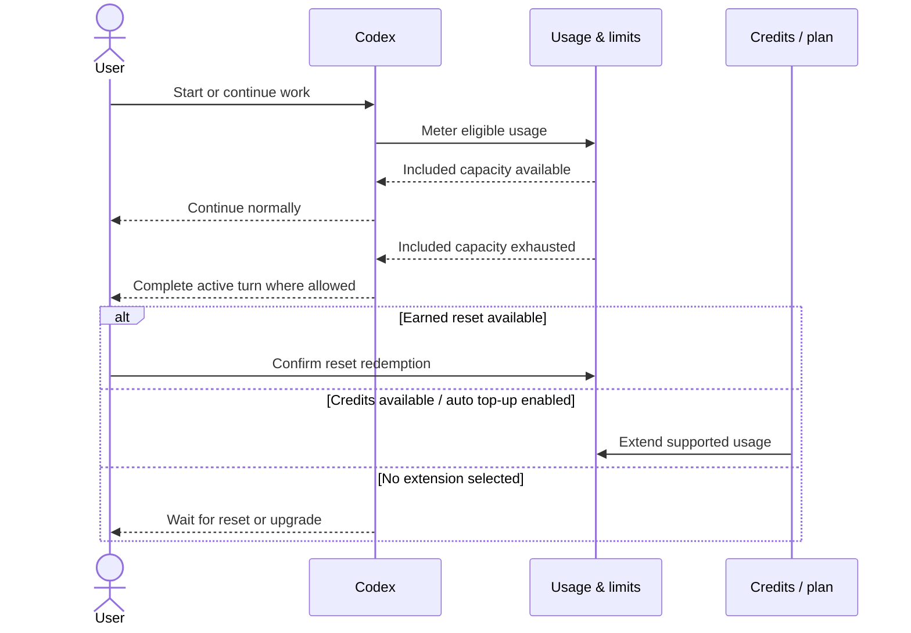
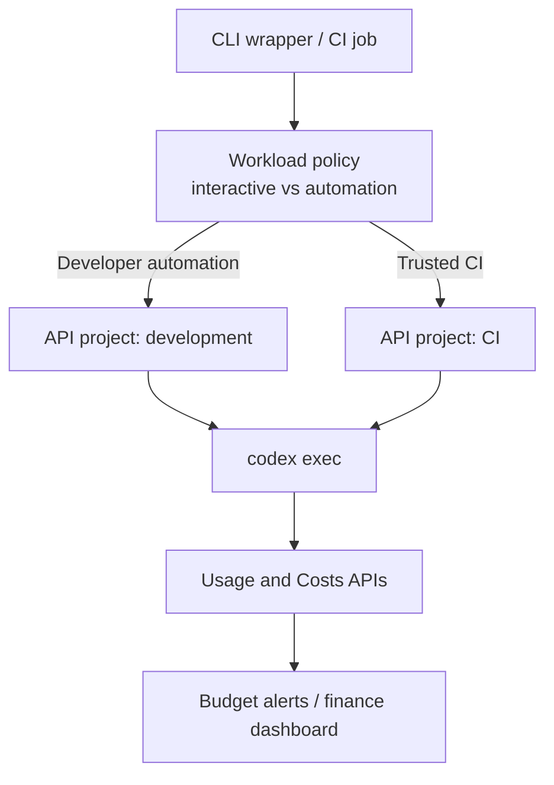
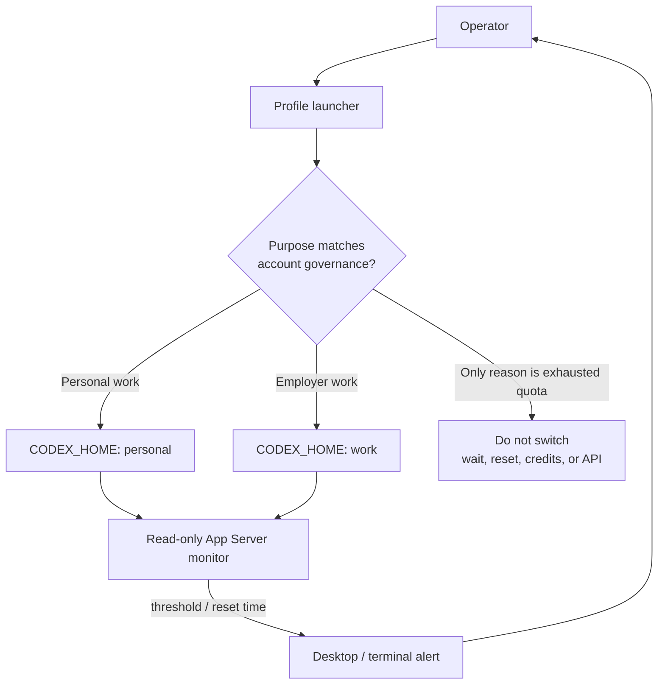
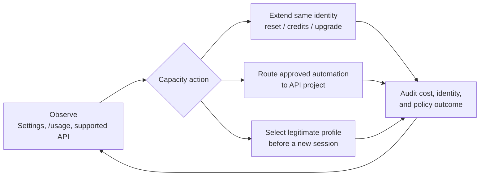

# Codex capacity continuity: decision brief

<!-- markdownlint-disable MD013 -->

- **Decision date:** 2026-08-04
- **Audience:** executive sponsor, engineering leadership, security
- **Decision:** choose a supported way to continue Codex work when an included usage window is exhausted—without pooling accounts to evade rate limits.

> [!IMPORTANT]
> **Recommendation:** do not build automatic account rotation triggered by an exhausted limit. OpenAI's current Terms prohibit circumventing rate limits or restrictions. Use **Path 1 (native credits/capacity)** now. Choose **Path 2 (API-first budget broker)** when predictable metered automation matters more than ChatGPT-plan features. Use **Path 3 (multi-profile monitor)** only to separate legitimate identities or workspaces, with a human-confirmed switch—not as a quota pool.

## TL;DR

### Three paths at a glance

| Path | Executive proposition | Pros | Cons | Verdict |
| --- | --- | --- | --- | --- |
| **1. Native capacity extension** | Keep one identity; use the built-in usage dashboard, earned reset when offered, plan upgrade, credits, and optional auto top-up. | Fastest; supported; preserves CLI, app, cloud, and workspace governance; almost no engineering or secret-handling risk. | Incremental spend; credit/reset availability varies by account and plan; less custom routing control. | **Recommend now** |
| **2. API-first budget broker** | Move repeatable local/CI workloads to API-key authentication and meter cost by API project. | Usage-based scaling; project-level attribution; Usage/Costs APIs; good automation boundary; no account rotation. | Separate API billing; API project budgets may be alerts rather than hard stops; API-key mode lacks some ChatGPT/cloud features; more engineering. | **Recommend for scaled automation** |
| **3. Multi-profile monitor, human gate** | Give each legitimate identity a separate `CODEX_HOME`; monitor supported rate-limit data and ask the operator to select the right context. | Clean account/workspace isolation; no copying during normal operation; exact rate-window telemetry is available; useful for work/personal separation. | Plaintext credential files if file storage is selected; duplicated local state; switching breaks session continuity; automatic quota pooling is a terms risk and is intentionally excluded. | **Use only for identity separation** |

### The core trade-off



### Executive scorecard

Scores are relative, from 1 (weak) to 5 (strong). “Compliance” evaluates the path as defined here—not an altered implementation that rotates accounts to bypass limits.

| Criterion | Weight | Path 1 | Path 2 | Path 3 |
| --- | ---: | ---: | ---: | ---: |
| Terms and governance alignment | 30% | 5 | 5 | 3 |
| Time to value | 20% | 5 | 3 | 3 |
| Continuity and reliability | 20% | 5 | 4 | 2 |
| Cost control and attribution | 15% | 3 | 5 | 2 |
| Feature coverage | 10% | 5 | 2 | 4 |
| Security simplicity | 5% | 5 | 3 | 2 |
| **Weighted result / 5** | **100%** | **4.7** | **4.1** | **2.7** |

## What the research establishes

1. **Codex exposes monitorable quota data.** The current App Server protocol documents `account/rateLimits/read` and `account/rateLimits/updated`. A response can contain multiple limit buckets, each with `usedPercent`, `windowDurationMins`, `resetsAt`, and `rateLimitReachedType`. This is more robust than scraping terminal text. See [Codex App Server—Auth endpoints](https://learn.chatgpt.com/docs/app-server#auth-endpoints).
2. **The CLI already provides human-facing usage controls.** `/status` shows rate limits and `/usage` shows daily, weekly, or cumulative token activity and available earned-reset actions. See [Codex CLI slash commands](https://learn.chatgpt.com/docs/developer-commands?surface=cli).
3. **Account state has a supported isolation boundary.** `CODEX_HOME` controls the root for config, authentication, logs, sessions, skills, and other state. See [Codex environment variables](https://learn.chatgpt.com/docs/config-file/environment-variables) and [advanced configuration](https://learn.chatgpt.com/docs/config-file/config-advanced#config-and-state-locations).
4. **`auth.json` is a secret and is mutable.** Codex may store access and refresh tokens in `CODEX_HOME/auth.json`, refresh ChatGPT tokens during use, and update the cache. OpenAI explicitly says to treat the file like a password. See [Codex authentication and credential storage](https://learn.chatgpt.com/docs/auth#credential-storage).
5. **Limits are not a single stable “weekly budget” number.** Local messages and cloud chats can share a five-hour window, additional weekly limits may apply, and actual consumption varies with model, task size, context, execution location, and fast mode. See [Codex pricing](https://learn.chatgpt.com/docs/pricing) and [Using Codex with a ChatGPT plan](https://help.openai.com/en/articles/11369540-using-codex-with-your-chatgpt-plan).
6. **Supported continuation mechanisms already exist.** Eligible Plus/Pro users can buy credits and may enable auto top-up; an active turn may finish after a limit is reached, after which the product can offer credits, an earned reset, upgrade, or waiting for reset. See [Using credits for flexible usage](https://help.openai.com/en/articles/12642688-using-credits-for-flexible-usage-in-chatgpt-free-go-plus-pro-sora).
7. **Multiple accounts are a supported separation concept, not a merged allowance.** ChatGPT web can keep two accounts signed in, but billing, subscriptions, workspaces, and history remain separate, and it does not automatically switch when one is unavailable. See [Use multiple accounts with account switching](https://help.openai.com/en/articles/20001068-use-multiple-accounts-with-account-switching).
8. **Automating rotation to defeat a limit is the red line.** The current European Terms prohibit interfering with the service, including circumventing rate limits or restrictions. The agent policy guidance repeats that users may not bypass rate limits. See [OpenAI Europe Terms of Use](https://openai.com/policies/terms-of-use/) and [Using ChatGPT agent in line with our policies](https://openai.com/policies/using-chatgpt-agent-in-line-with-our-policies/#5-circumventing-restrictions-and-safeguards).

This is a product and engineering risk assessment, not legal advice. If the intended accounts are all paid personal accounts used by the same person and the goal remains aggregation after exhaustion, obtain written confirmation from OpenAI before automating it.

## Path 1 — Native capacity extension

### Native operating model

Stay on one account/workspace and let OpenAI's supported controls handle the capacity transition:

1. show current limits in Settings, `/status`, or `/usage`;
2. consume an earned reset if one is offered and the operator confirms it;
3. draw from purchased credits after included usage is exhausted;
4. optionally configure auto top-up and a spending target where eligible;
5. upgrade the plan or workspace allocation if sustained demand justifies it.



### Native business case

- **Best fit:** one person or team that wants continuity and full Codex functionality.
- **Time to value:** hours, mostly configuration and spend-policy approval.
- **Operational ownership:** account/workspace owner rather than a custom service owner.
- **Control plane:** Codex Settings and workspace billing controls.
- **Primary risk:** uncontrolled top-up spend. Mitigate with a documented monthly ceiling, alerts, owner review, and lower-cost model selection for routine work.

### Why it wins

It keeps identity, workspace policy, history, and entitlements coherent. It also follows the product's intended limit lifecycle. The current pricing page states that ChatGPT Work and Codex share usage, so buying or allocating capacity once is clearer than operating several opaque allowances.

### Native capacity caveats

- Eligibility for credits, auto top-up, and earned resets varies.
- Included limits and credit rates can change; do not hard-code plan numbers.
- A single account can still be unavailable because of authentication, service incidents, or workspace policy—not only capacity.

## Path 2 — API-first budget broker

### Broker operating model

Move automation-heavy or predictable workloads to Codex's API-key mode. Use one OpenAI API organization with separate projects for environments or cost centers, and route work according to explicit business policy—not according to attempts to escape subscription limits.



### Broker business case

- **Best fit:** CI, batch work, internal developer tooling, and teams that need project-level attribution.
- **Time to value:** several days for a thin wrapper; several weeks for hardened policy, telemetry, and secret management.
- **Operational ownership:** platform engineering plus FinOps/security.
- **Control plane:** API projects, keys/service accounts, Usage API, Costs API, and billing alerts.
- **Primary risk:** assuming a budget alert is a hard stop. The documented project monthly budget behavior may be a soft threshold; enforce any required hard ceiling in the broker and verify current platform capabilities.

The API Usage service can filter by project and API key, while the Costs endpoint groups spend by project or line item. See the [Usage API reference](https://platform.openai.com/docs/api-reference/usage) and [managing API projects](https://help.openai.com/en/articles/9186755-managing-projects-in-the-api-platform).

### Implementation shape

- Use a dedicated project and least-privilege key per environment.
- Inject `CODEX_API_KEY` only into the single `codex exec` process; the current CLI documents that this override is for non-interactive execution.
- Put hard stop logic before invocation if the organization requires one.
- Poll or export cost data for finance; do not infer money solely from local token logs.
- Keep secrets in an OS keyring or secret manager, never in repo configuration or shell history.
- Avoid exposing keys to repository-controlled setup scripts, tests, or dependency hooks.

### Broker caveats

- API use is billed separately from ChatGPT subscriptions.
- API-key authentication supports local Codex workflows, but some ChatGPT workspace and cloud features are limited or unavailable.
- The broker must handle retry, idempotency, spend races, and stale telemetry.
- This path changes the commercial model from included plan capacity to metered usage.

## Path 3 — Multi-profile monitor with a human policy gate

### Profile operating model

For legitimate account boundaries—such as personal versus employer-managed work—store each identity in a separate `CODEX_HOME`. A small local monitor reads each authenticated profile's supported rate-limit endpoint, displays health and reset times, and asks the operator which identity is appropriate for the next new session.

**It must not automatically select another account because the current account is exhausted.** That would turn a separation tool into a limit-circumvention tool.



### Safer state layout

```text
~/.local/share/codex-profiles/
├── personal/              # mode 0700
│   ├── auth.json           # mode 0600; never committed
│   ├── config.toml
│   └── ...                 # sessions, logs, SQLite state, skills
└── employer/              # mode 0700
    ├── auth.json           # separate identity and workspace policy
    ├── config.toml
    └── ...
```

Example launch boundaries:

```sh
CODEX_HOME="$HOME/.local/share/codex-profiles/personal" codex
CODEX_HOME="$HOME/.local/share/codex-profiles/employer" codex
```

Each directory must already exist. If file-based credential storage is required for deterministic separation, set `cli_auth_credentials_store = "file"` inside each profile and accept the plaintext-secret implications. Otherwise prefer the OS credential store, after verifying that the platform isolates entries as intended.

### Why not replace `~/.codex/auth.json` in place?

| Failure mode | Consequence |
| --- | --- |
| Codex refreshes a token while the switcher replaces the file | Lost refresh state, stale credentials, or one account overwriting another profile's cache. |
| Two CLI/app-server processes run concurrently | A global file lock cannot safely change the already-loaded identity of both processes. |
| A session is resumed under another identity/workspace | Governance, billing, retention, and feature availability can change mid-workflow. |
| Copy, backup, logs, or crash dump captures the file | Access and refresh tokens are exposed. |
| A symlink or partial write is followed | Credential corruption or a path-manipulation vulnerability. |
| Detection relies on terminal error strings | Version and localization changes break the automation; false switchover becomes likely. |

Separate roots turn account selection into a **process-start boundary**, which is observable and testable. They do not make quota pooling acceptable.

### Monitor contract

For each profile, the monitor should:

1. start `codex app-server` with that profile's `CODEX_HOME`;
2. complete the JSONL `initialize` / `initialized` handshake;
3. call `account/read` without printing email or tokens;
4. call `account/rateLimits/read`;
5. normalize every entry in `rateLimitsByLimitId`, falling back to the legacy `rateLimits` field;
6. evaluate both `primary` and `secondary` windows;
7. alert at a configurable threshold such as 85–90%, including `resetsAt`;
8. consume no reset and launch no other identity without an explicit human action;
9. merge sparse `account/rateLimits/updated` notifications or refetch the full snapshot;
10. redact account identifiers and never serialize credential payloads.

Suggested states are `healthy`, `approaching_limit`, `reached`, `auth_required`, `unavailable`, and `stale`. Unknown buckets must be displayed, not ignored.

### Operational limitations

- A transparent mid-turn handover is not realistic. OpenAI states that an active turn may finish after the limit is reached; the next turn is the natural decision boundary.
- Different `CODEX_HOME` roots also separate sessions, plugins, skills, logs, and SQLite state. That is safer but less convenient.
- App Server is currently marked experimental. Pin a tested Codex CLI version and regenerate schemas during upgrades.
- Rate-limit windows are service data, not a promise of future plan capacity.

## Prototype and test evidence

Tests were performed locally on Linux with **`codex-cli 0.146.0`** on 2026-08-04. No live credential contents were read, printed, copied, or modified.

| Test | Method | Result | Implication |
| --- | --- | --- | --- |
| CLI capability discovery | Inspected `codex --help`, `codex login --help`, and App Server help. | `login status`, API-key/access-token login, `CODEX_HOME`, stdio App Server, and schema generation are present. | No terminal scraping is necessary for the core design. |
| Profile isolation | Started App Server against two independent temporary `CODEX_HOME` directories. | Each handshake returned its own `codexHome`; each root created independent state. | Process-level profiles are mechanically feasible. |
| Authentication guard | Called `account/read` and `account/rateLimits/read` in an empty profile. | `account/read` returned no account; rate-limit read returned `codex account authentication required`. | Monitoring respects the selected profile's authentication boundary. |
| Current schema | Generated the CLI's experimental JSON Schema bundle. | The bundle contains `account/rateLimits/read`, `usedPercent`, `windowDurationMins`, and `rateLimitReachedType`, plus sparse update notifications. | A typed monitor can be generated for the installed version. |
| Parser proof of concept | Python standard-library parser evaluated modern multi-bucket, secondary-window, and legacy single-bucket fixtures. | **3/3 fixtures passed**; 89% returned `OK`, 91% and 100% returned `ALERT`. | Threshold logic is small and testable; all windows must be evaluated. |
| Empty-profile status | Ran `codex login status` against two temporary roots. | Both exited non-zero and reported `Not logged in`. | The launcher can fail closed before starting work. |

### Prototype decision logic

The tested proof of concept intentionally stops at alerting:

```python
def decision(rate_limits, threshold=90):
    buckets = rate_limits.get("rateLimitsByLimitId")
    if not buckets:
        legacy = rate_limits["rateLimits"]
        buckets = {legacy["limitId"]: legacy}

    windows = (
        bucket[slot]
        for bucket in buckets.values()
        for slot in ("primary", "secondary")
        if bucket.get(slot)
    )
    return "ALERT" if any(w["usedPercent"] >= threshold for w in windows) else "OK"
```

Deliberately absent: credential copying, automatic `CODEX_HOME` selection after exhaustion, reset redemption, and retrying a rejected task through another subscription.

## Recommended target operating model



### Phased recommendation

#### Phase 0 — immediately

- Enable the native usage view and define who may buy credits, redeem resets, or enable auto top-up.
- Set a monthly spend envelope and escalation owner.
- Prefer lower-cost/lighter models for routine work where quality remains acceptable.

#### Phase 1 — one small engineering iteration

- Build only the read-only monitor and notification layer using App Server.
- Pin the CLI version, generate protocol schemas in CI, and test legacy and multi-bucket responses.
- If multiple legitimate identities are required, add named `CODEX_HOME` launchers with a human policy gate and a visible active-profile banner.

#### Phase 2 — when automation spend warrants it

- Create API projects for developer automation and CI.
- Add Costs API reporting, preflight spend policy, least-privilege secrets, and auditable routing.
- Keep interactive ChatGPT-plan work and API-metered automation as explicit lanes.

### Go / no-go controls for any implementation

Proceed only if all are true:

- the design does not rotate identities merely because a quota was exhausted;
- each account is used by its authorized individual and under its workspace policy;
- credentials remain in a keyring/secret store or mode-0600 file under a mode-0700 directory;
- account selection occurs before a new process/session, not during an active turn;
- the active identity and billing lane are visible to the operator;
- logs contain no tokens, `auth.json` bodies, or full account identifiers;
- schema/version drift fails closed;
- security and legal owners approve the operating purpose.

Stop if any are true:

- the success metric is “more subscription capacity by cycling accounts”;
- the tool retries a rate-limited request with another account automatically;
- multiple processes share or rewrite one live `auth.json`;
- the system assumes a displayed budget is a hard financial cap without verification;
- work governed by one organization is silently moved to another identity.

## Final decision

**Fund Path 1 now.** It solves the business need with supported product controls and the least operational risk. **Prototype Path 2 next** if recurring automation makes metered API spend and cost attribution worthwhile. **Limit Path 3 to a read-only dashboard and explicit identity separation.** Do not ship limit-triggered automatic handover unless OpenAI provides a documented, approved account-pooling capability or written authorization for this exact use case.

## Source register

All sources were retrieved from official OpenAI properties on 2026-08-04. Product limits, prices, protocol stability, and eligibility can change.

- [Codex App Server](https://learn.chatgpt.com/docs/app-server)
- [Codex authentication](https://learn.chatgpt.com/docs/auth)
- [Codex environment variables](https://learn.chatgpt.com/docs/config-file/environment-variables)
- [Codex pricing](https://learn.chatgpt.com/docs/pricing)
- [ChatGPT usage limits and spend controls](https://learn.chatgpt.com/docs/enterprise/usage-limits)
- [Using Codex with your ChatGPT plan](https://help.openai.com/en/articles/11369540-using-codex-with-your-chatgpt-plan)
- [Using credits for flexible usage](https://help.openai.com/en/articles/12642688-using-credits-for-flexible-usage-in-chatgpt-free-go-plus-pro-sora)
- [Codex rate card](https://help.openai.com/en/articles/20001106-codex-rate-card)
- [Use multiple accounts with account switching](https://help.openai.com/en/articles/20001068-use-multiple-accounts-with-account-switching)
- [Managing projects in the API platform](https://help.openai.com/en/articles/9186755-managing-projects-in-the-api-platform)
- [OpenAI API Usage reference](https://platform.openai.com/docs/api-reference/usage)
- [OpenAI Europe Terms of Use](https://openai.com/policies/terms-of-use/)
- [Using ChatGPT agent in line with our policies](https://openai.com/policies/using-chatgpt-agent-in-line-with-our-policies/)
