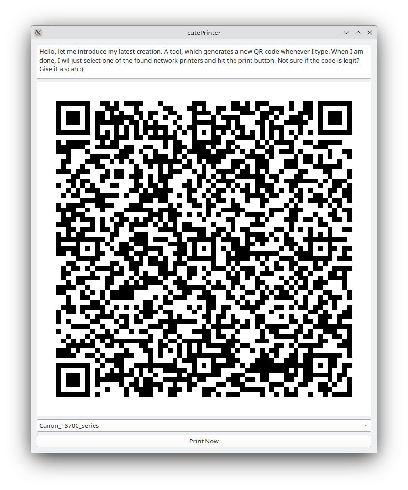

# QR Code Generator and Printer

## Description

This application provides a simple GUI to generate QR codes from text input and print them using available printers on the network. It is developed using PyQt5 for the GUI and the `qrcode` library for generating QR codes. The application is designed to work on Linux environments and supports printing through the system's available printers.

### Functionality

- Generate QR codes in real-time as you type.
- Display the generated QR code within the application window.
- List all available network printers in a dropdown menu.
- Print the displayed QR code to the selected printer.



## Setup

### Requirements

- Python 3
- PyQt5
- qrcode[pil]
- A Linux environment with access to network printers

### Installation

1. Clone this repository or download the source code.
2. Navigate to the project directory.
3. Install the required Python libraries:

```bash
pip install -r requirements.txt
```

### How to Run

- Execute the application:
```bash
python3 cutePrinter.py
```

1. Enter the text you wish to generate a QR code for in the text input field.
1. Select a printer from the dropdown menu labeled "None" by default.
1. Click the "Print Now" button to send the QR code to the selected printer.

### Author
Marcel Petrick - mail@marcelpetrick.it

### License
This project is licensed under the GNU General Public License v3.0