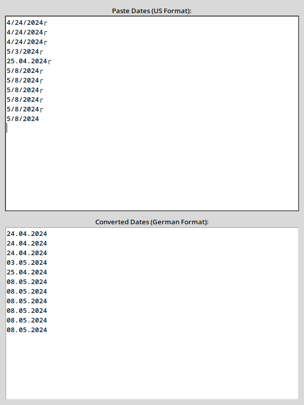

# Date Converter GUI

## Overview
This is a simple desktop GUI application that helps convert dates from the US format (MM/DD/YYYY) to the German format (DD.MM.YYYY). It's designed for quickly pasting a list of US-formatted dates and getting a clean, converted result.  
Since the input is mixed sometimes, it is checked line by line.

The conversion is dynamic: as you type or paste into the input field, the output updates automatically.

## Features
- Converts US-style dates to German format
- Handles malformed dates gracefully
- Input and output fields with equal size for clarity
- Supports common keyboard shortcuts:
  - **Ctrl+A** to select all text
  - **Ctrl+C** to copy
  - **Ctrl+X** to cut
  - **Delete** to remove selected text

## Use Case
You might receive a list of dates in US format (e.g., from spreadsheets or web pages) and need them in German format for reporting, documentation, or data entry in systems requiring the DD.MM.YYYY format.

Just paste the dates into the top field and copy the converted result from the bottom.

## How to Run
### Prerequisites
Ensure you have Python 3.10 or later installed. This app uses only standard Python libraries.

### Steps
1. Save the script to a file, for example: `main.py`
2. Open a terminal and run:
```bash
python main.py
```
3. The application window will open. Paste dates into the top field. The converted dates will appear below automatically.

---

No installation of external libraries is required.



### Testing
If you want to exectue the builtin unit-tests, run:
```bash
python main.py --tests
```
