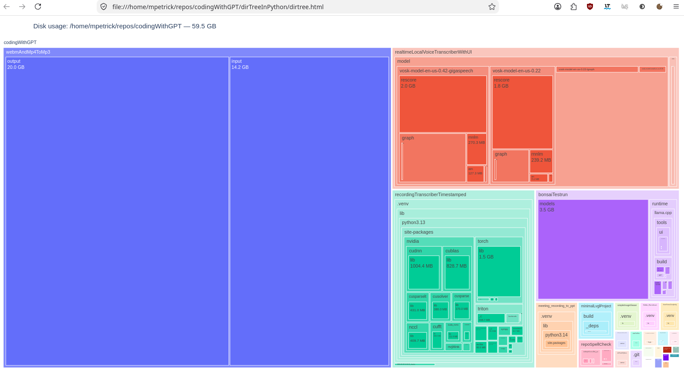

# README.md

## dirtree — interactive disk-usage treemap

One script that answers *"where did my 250 GB go?"*. It scans a directory
recursively, prints the largest subdirectories to the console and writes an
interactive HTML treemap: rectangle area equals disk usage, click to drill down.

Works on **Windows 11, Linux and macOS** with CPython >= 3.7.



---

## Features

* **One file, one dependency** – `dirtree.py` plus `plotly`
* **Interactive** – click a rectangle to zoom in, click the header bar to go back up
* **Console summary** – top-N largest directories, no browser needed
* **Loop-safe** – symlinks are skipped, Windows junctions are caught by a
  device/inode guard, so `C:\` cannot walk in circles
* **`du`-like accounting** – hardlinked files counted once (where the OS reports
  link counts), `-x` stays on one filesystem / drive
* **Robust** – permission-denied and unreadable entries are counted and skipped,
  never fatal

---

## Installation

```bash
python3 -m venv .venv
source .venv/bin/activate          # Windows: .venv\Scripts\activate
pip install -r requirements.txt
```

---

## Usage

```bash
python dirtree.py .                      # current directory
python dirtree.py C:\                    # whole drive          (Windows)
python dirtree.py / -x                   # root filesystem      (Linux/macOS)
python dirtree.py C:\ --min-mb 500       # hide clutter below 500 MB
python dirtree.py /var --no-browser      # just write the HTML
```

Example output:

```
Scanning: /home/user/projects
This may take a little while on large drives...

Total: 42.0 MB
Directories scanned: 5

Largest directories:
----------------------------------------------------------------------
   30.0 MB  big
   12.0 MB  nested/deep
   12.0 MB  nested
    4.0 KB  small

Interactive map written to:
/home/user/projects/dirtree.html
```

---

## Options

| Option | Default | Meaning |
| --- | --- | --- |
| `path` | `.` | directory to scan |
| `--min-mb` | `10` | hide directories below this size in the treemap |
| `-x`, `--one-filesystem` | off | do not cross mount points / drive boundaries (like `du -x`) |
| `--top` | `25` | how many directories to list on the console |
| `--output` | `dirtree.html` | HTML output file |
| `--no-browser` | off | do not open the result in a browser |

---

## Platform notes

* **Linux/macOS** – scanning `/` without `-x` descends into every mounted
  filesystem (NAS shares, external disks, Docker volumes, `/proc`, `/sys`),
  which makes the total confusing. Use `-x` for a `du -x`-style view.
* **Windows** – `st_ino`/`st_nlink` are not filled in by `scandir`, so hardlinks
  (rare on Windows) may be counted per link. Paths longer than 260 characters
  are skipped and reported in the "inaccessible entries" count unless long path
  support is enabled in the OS.
* Sizes are apparent file sizes (`st_size`), not allocated blocks, so sparse
  files and compressed filesystems can differ from what the OS reports.

---

## License

GPLv3 (c) 2026 [mail@marcelpetrick.it](mailto:mail@marcelpetrick.it)

Contributions welcome!
