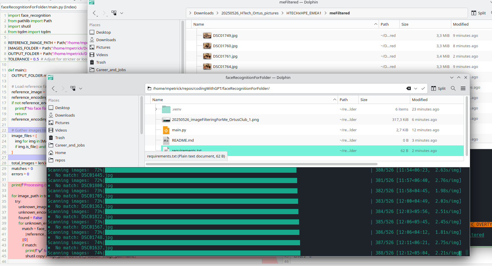

# Face Recognition Filter for your own face

This tool filters a folder of images, copying all photos containing your face (based on a reference photo) to a separate output folder. It is optimized for speed using all CPU cores.  
Set up input and output folders directly in the `main.py` and provide a cropped image of your face (frontal).

## Quickstart

1. **Clone or copy the script to your project folder.**
2. **Create and activate a Python virtual environment:**

   ```bash
   python3 -m venv .venv
   source .venv/bin/activate
   ```
3. **Install dependencies:**

   ```bash
   python3 -m pip install -r requirements.txt
   ```
4. **Edit script paths for your reference image and input/output folders.**
5. **Run the script:**

   ```bash
   python3 main.py
   ```

## How it Works

* You provide a clear reference image of your face.
* The script scans all images in a folder using face recognition technology.
* Any photo where your face is detected (within a set tolerance) is copied to an output folder.
* Uses all CPU cores for fast parallel processing, even on large collections.

## Proof of Concept



---

**Fast, simple, and works offline.**
