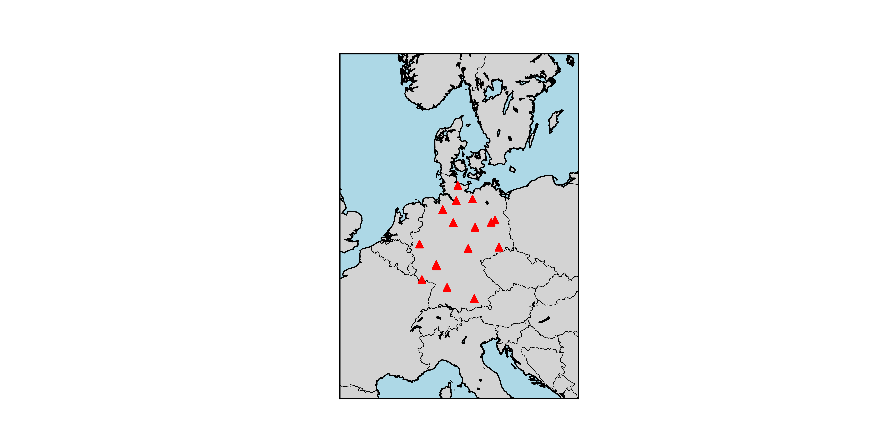

# GeoLocViz

GeoLoc(ation)Viz(ualizer) is a Python application designed for visualizing geographical locations on a 2D map. This tool takes a list of location names, converts them into latitude and longitude coordinates, and plots them on a world map. It features a caching mechanism to optimize repeated lookups and is ideal for mapping out a series of travel destinations, landmarks, or any set of locations specified in a text file.

## Author

Marcel Petrick - mail@marcelpetrick.it

## Features

- **Geocoding**: Converts location names into geographical coordinates.
- **Caching**: Saves geocoded locations in a cache file (`geocache.json`) for faster subsequent access.
- **Map Visualization**: Plots the geocoded locations on a 2D map with adjustable margins.
- **File Parsing**: Reads locations from a specified text file, automatically stripping dates and extraneous information.
- **Customization**: Allows for dynamic map scaling based on the locations plotted.

## Installation

1. Clone the repository or download the source code.
2. Ensure Python is installed on your system.
3. Install required Python packages:

```bash
pip install -r requirements.txt
```

## Usage

Run the script from the command line, optionally specifying the path to a text file containing locations:

```bash
python geoLocViz.py [path_to_location_file]
```

## Example of a location file (touristlocations_example.md):

```markdown
* 20230408 Waldspielplatz Pöring, Germany
* 20230409 Hohendilching/Grub (Wandern Mangfall), Germany
* 20230410 Truderinger Wald (Wandern), Germany
* 20230415 Rottenbuch (Wandern), Germany
```

The script will read the locations, geocode them, and plot them on a map saved as map.png in the current directory.

## Example output with `bundeslaender_germany.md`



## Contributions

Contributions, issues, and feature requests are welcome. Feel free to check issues page if you want to contribute.
