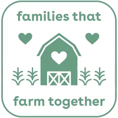
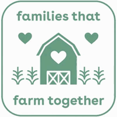

# Farm logo animation

## Task

Turn the supplied MP4 into a cute, three-second looping GIF. A sheep should walk
into the image from the right toward the barn, while flowers bloom on the left.
Preserve the original logo, wording, and sage-green style.

## Input

- [Original MP4](WhatsApp%20Video%202026-09-16%20at%2010.27.58.mp4)
- H.264 MP4, 200 × 200 pixels, 10 frames per second.
- Duration: 0.4 seconds, containing four nearly identical logo frames.
- The logo reads “families that” / “farm together”, with a barn, hearts, plants,
  and a rounded border.

Original, converted to GIF:



## Result



- [Finished GIF, original 200 × 200 size](output/farm-loop.gif)
- [Finished GIF, enlarged 600 × 600 version](output/farm-loop-600.gif)
- [MP4 preview, 600 × 600](output/farm-loop.mp4)
- [Six-frame overview](output/preview.png)
- [Original clip as a GIF](output/original.gif)

Both finished GIFs run for exactly three seconds and repeat indefinitely. The
sheep walks from the right toward the barn with four cycling leg poses and a
gentle bounce. It becomes smaller and fades at the doorway so the loop can
restart. Three sage-green flowers on the left unfurl in sequence, then close.
The first and last images match, giving the loop a clean boundary.

The 600-pixel export enlarges the supplied 200-pixel logo; it does not restore
detail missing from the source. The original wording, hearts, barn, and border
are preserved in the stationary background.

## Work and tools

- FFprobe: inspect the input format, dimensions, duration, and frame count.
- FFmpeg: extract all four reference frames and encode the MP4 preview.
- Codex `imagegen` skill with the **built-in image generation tool**: create a
  four-pose sheep sprite sheet using the original logo as a style reference.
  No image generation CLI or separately configured API key was used.
- Python with Pillow: extract sprites, animate their position and walking poses,
  draw blooming petals, generate a shared GIF palette, and export both GIF sizes.
- Git: commit the input, reproducible animation source, documentation, and results.

The generator returned an RGB image with a baked-in transparency checkerboard.
The animation script removes the connected neutral background while preserving
the enclosed white wool. Both the generated sheet and extracted transparent
sheet are included in [output/assets](output/assets).

The exact image generation prompt is saved in
[sheep-prompt.txt](output/assets/sheep-prompt.txt). The saved sprites make the
animation reproducible without generating new artwork.

## Rebuild

Requires Python 3, FFmpeg, and FFprobe on the system path.

```sh
python3 -m venv .venv
.venv/bin/pip install -r requirements.txt
.venv/bin/python animate.py
```

The script resolves paths relative to itself and rebuilds the GIFs, MP4, reference
frames, transparent sheep sheet, and preview. Animation timing and flower/sheep
positions are defined in [animate.py](animate.py).

## Verification

- Inspected the four source frames and the generated sheep artwork visually.
- Inspected six rendered moments for sheep direction, blooming flowers, logo
  readability, and the return to the original image.
- Decoded both GIFs: 200 × 200 and 600 × 600, exactly **3,000 ms** each, infinite
  repeat (`loop=0`), and identical first/last decoded images.
- GIF encoding combines repeated stationary images: each GIF stores 55 frames
  with their durations preserved, from 60 rendered images at 50 ms intervals.
- FFprobe confirmed the preview is 600 × 600, 20 fps, 60 frames, and exactly
  **3.000 seconds**.
