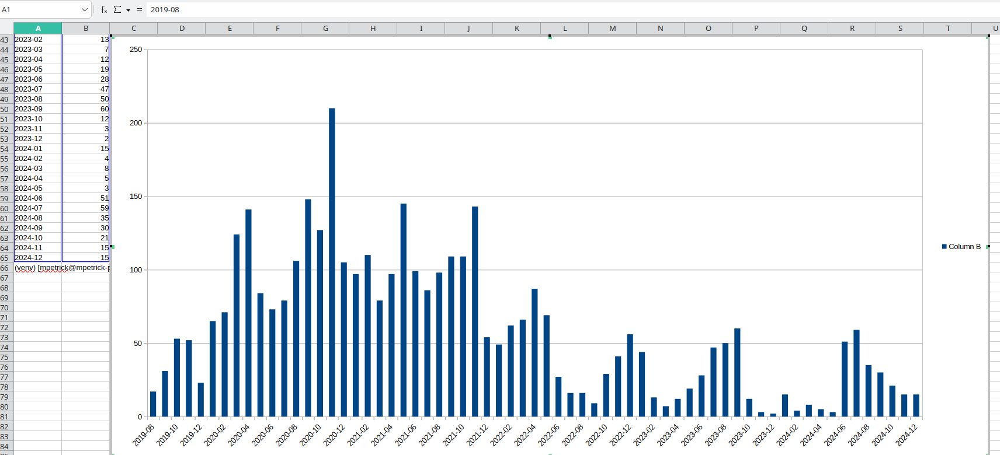

Create some basic git-stats for a repo
* possible to group by day (default) or by month, also possible to get bars for the command line as simple visualisation
* attention: empty month are not shown - only those with data!

## Example output
```bash
$ python3 gitStatsOverTime.py ../ --bars --month
2023-04: 35: ▒▒▒▒▒▒▒▒▒▒▒▒▒▒▒▒▒▒▒▒▒▒▒▒▒▒▒▒▒▒▒▒▒▒▒
2023-05: 49: ▒▒▒▒▒▒▒▒▒▒▒▒▒▒▒▒▒▒▒▒▒▒▒▒▒▒▒▒▒▒▒▒▒▒▒▒▒▒▒▒▒▒▒▒▒▒▒▒▒
2023-06: 22: ▒▒▒▒▒▒▒▒▒▒▒▒▒▒▒▒▒▒▒▒▒▒
2023-07:  4: ▒▒▒▒
2023-08: 69: ▒▒▒▒▒▒▒▒▒▒▒▒▒▒▒▒▒▒▒▒▒▒▒▒▒▒▒▒▒▒▒▒▒▒▒▒▒▒▒▒▒▒▒▒▒▒▒▒▒▒▒▒▒▒▒▒▒▒▒▒▒▒▒▒▒▒▒▒▒
2023-09: 31: ▒▒▒▒▒▒▒▒▒▒▒▒▒▒▒▒▒▒▒▒▒▒▒▒▒▒▒▒▒▒▒
2023-10:  2: ▒▒
2023-11: 10: ▒▒▒▒▒▒▒▒▒▒
2023-12: 38: ▒▒▒▒▒▒▒▒▒▒▒▒▒▒▒▒▒▒▒▒▒▒▒▒▒▒▒▒▒▒▒▒▒▒▒▒▒▒
2024-01: 10: ▒▒▒▒▒▒▒▒▒▒
2024-02: 10: ▒▒▒▒▒▒▒▒▒▒
2024-03: 25: ▒▒▒▒▒▒▒▒▒▒▒▒▒▒▒▒▒▒▒▒▒▒▒▒▒
2024-04: 17: ▒▒▒▒▒▒▒▒▒▒▒▒▒▒▒▒▒
2024-05:  3: ▒▒▒
2024-06: 11: ▒▒▒▒▒▒▒▒▒▒▒
2024-07:  8: ▒▒▒▒▒▒▒▒
2024-08: 12: ▒▒▒▒▒▒▒▒▒▒▒▒
2024-10:  5: ▒▒▒▒▒
2024-11: 14: ▒▒▒▒▒▒▒▒▒▒▒▒▒▒
2024-12:  3: ▒▒▒
2025-01:  5: ▒▒▒▒▒
2025-02:  1: ▒
2025-03: 18: ▒▒▒▒▒▒▒▒▒▒▒▒▒▒▒▒▒▒
2025-04:  7: ▒▒▒▒▒▒▒
2025-05:  9: ▒▒▒▒▒▒▒▒▒
2025-06:  9: ▒▒▒▒▒▒▒▒▒
2025-07:  1: ▒
```

## Rendered with some poplar sheet-editor

