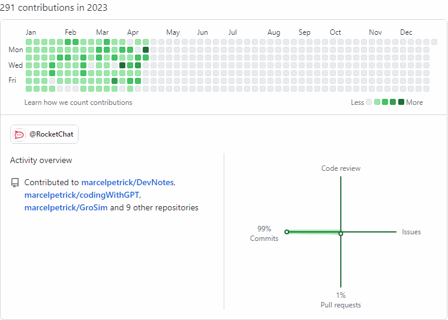

# What is this?
One of the ideas on my crazy-list was a web-scraper, which screenshots the commit-graph for each year I was active on Github. Then combines them into a gif.  
I never dedicated time to investigate this. 

Used the opportunity. Asked first which ways to use to render/get the images? One of the suggestions was the Selenium-framework. I had some experience with automation (see #autoit), but not with Selenium. First try to use the connector for Firefox did not work out due to technical reasons. Decided then to ask for code for Edge. This worked. Additional prompts and some correction led to a function which generates all urls, takes all images in a loop, then combines them. Wow.  

Time invested: 110 min.

Without help I would have done more research, reading and trial&error. Definitely not below 4h.  But the structure of the code would have been better. I did not want to alter the results from the prompts so much, so I had to use some awkward calls. But it works.

## Result


## Resulting call

```
C:\Users\mpetrick\AppData\Local\Microsoft\WindowsApps\python3.11.exe C:\mpetrick\repos\codingWithGPT\githubYearlyOutputScraper\githubYearlyOutputScraper.py 
C:\mpetrick\repos\codingWithGPT\githubYearlyOutputScraper\githubYearlyOutputScraper.py:51: DeprecationWarning: headless property is deprecated, instead use add_argument('--headless') or add_argument('--headless=new')
  options.headless = True
C:\mpetrick\repos\codingWithGPT\githubYearlyOutputScraper\githubYearlyOutputScraper.py:54: DeprecationWarning: executable_path has been deprecated, please pass in a Service object
  browser = webdriver.Edge(executable_path=edge_driver_path, options=options)
{2015: 'https://github.com/marcelpetrick?tab=overview&from=2015-01-01&to=2015-12-31', 2016: 'https://github.com/marcelpetrick?tab=overview&from=2016-01-01&to=2016-12-31', 2017: 'https://github.com/marcelpetrick?tab=overview&from=2017-01-01&to=2017-12-31', 2018: 'https://github.com/marcelpetrick?tab=overview&from=2018-01-01&to=2018-12-31', 2019: 'https://github.com/marcelpetrick?tab=overview&from=2019-01-01&to=2019-12-31', 2020: 'https://github.com/marcelpetrick?tab=overview&from=2020-01-01&to=2020-12-31', 2021: 'https://github.com/marcelpetrick?tab=overview&from=2021-01-01&to=2021-12-31', 2022: 'https://github.com/marcelpetrick?tab=overview&from=2022-01-01&to=2022-12-31', 2023: 'https://github.com/marcelpetrick?tab=overview&from=2023-01-01&to=2023-12-31'}
processing 2015
processing 2016
processing 2017
processing 2018
processing 2019
processing 2020
processing 2021
processing 2022
processing 2023

Process finished with exit code 0
```
