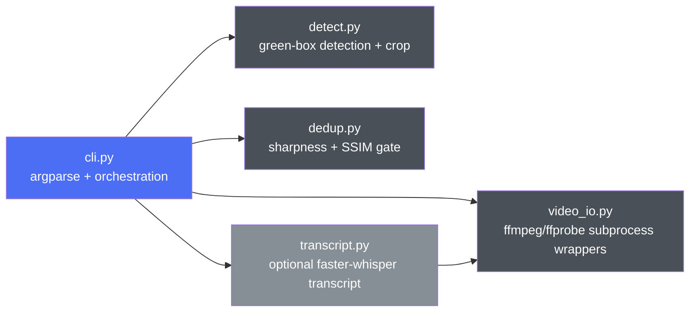
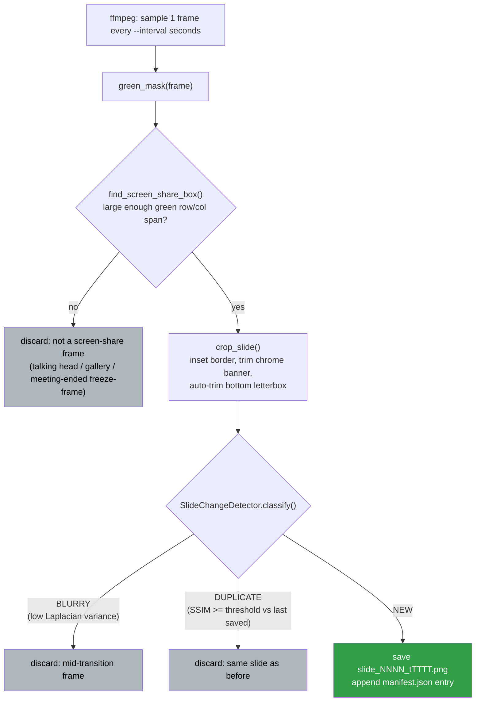
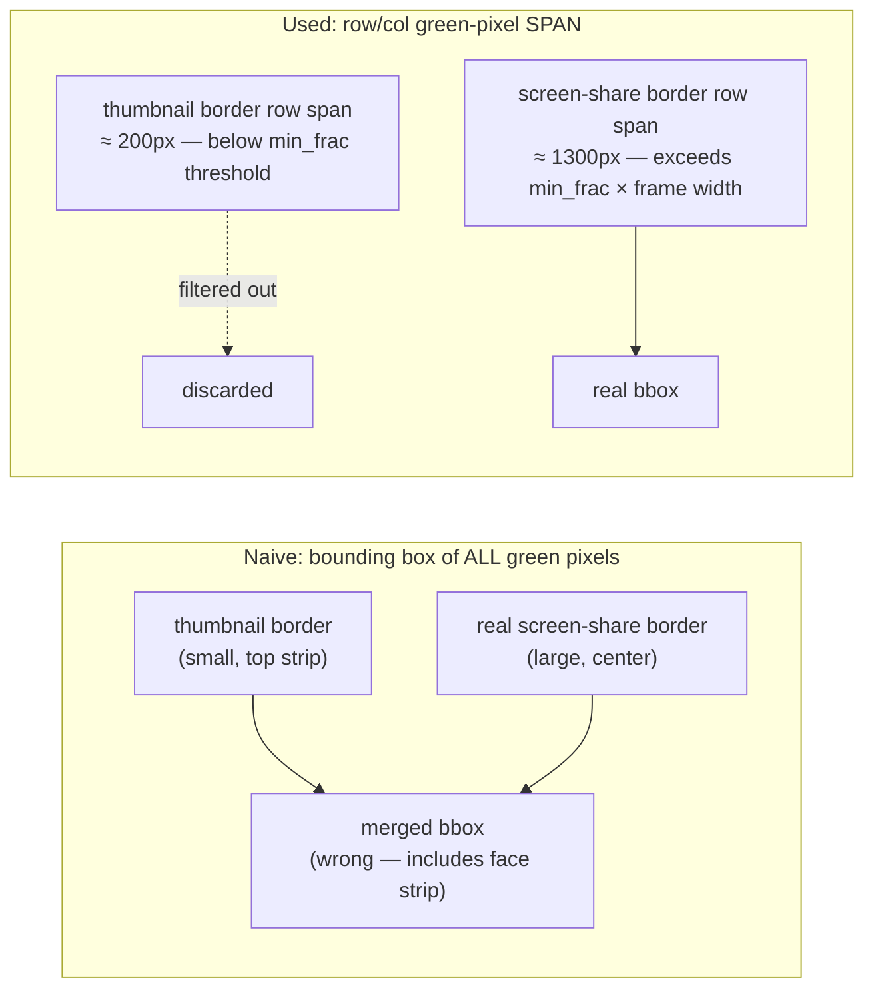
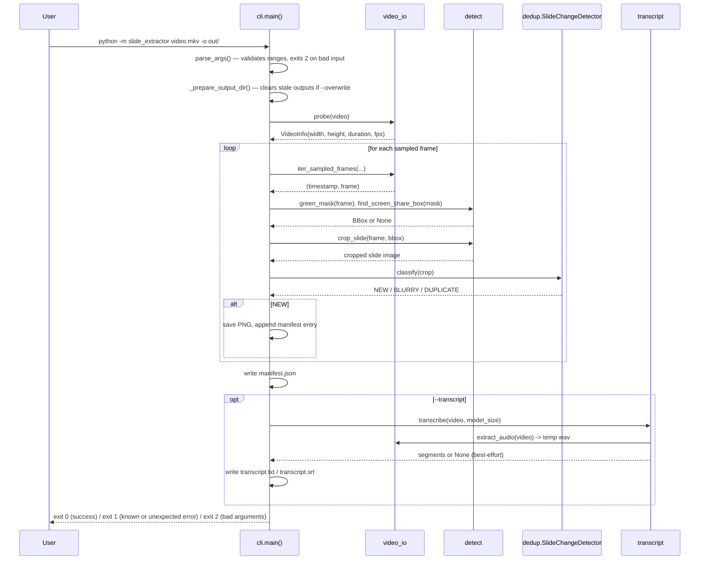
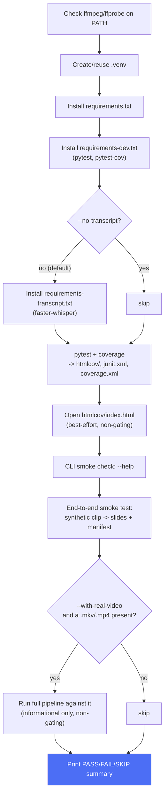

# Architecture

How `slide_extractor` turns a screen-recorded meeting video into a
deduplicated set of slide PNGs (and, optionally, a transcript), and how
`localPipeline.sh` sets up and verifies all of it locally.

## Module map

`cli.py` is the only module that imports the other four; they don't
depend on each other except `transcript.py`, which reuses
`video_io.extract_audio`. This keeps each concern independently testable
(see `tests/test_detect.py`, `tests/test_dedup.py`, `tests/test_video_io.py`,
`tests/test_transcript.py` — none of them need the full CLI wired up).

## Per-frame pipeline

Every sampled frame goes through the same decision chain. Most frames are
discarded early (talking-head segments have no green box at all); only
frames that pass every gate get written to disk.

Rejections are counted separately (`rejected_no_box`, `rejected_blurry`,
`rejected_duplicate`) precisely so a run that produces fewer slides than
expected can be diagnosed from the log line alone instead of guessing:

- Mostly `rejected_no_box` → the recording rarely/never had an active,
  pinned screen share (or the Zoom highlight border isn't there for some
  other reason — see `README.md` limitations).
- Nonzero `rejected_blurry` dominating → `--min-sharpness` is too strict
  for this recording's slide style; lower it.
- `rejected_duplicate` dominating when slides *are* visibly changing →
  `--ssim-threshold` is too lenient, or the crop region itself is wrong
  (check `--debug` output, `--top-trim-px`/`--bottom-trim-px`).

## Why green-box detection works (and the pitfall it avoids)

`find_screen_share_box()` doesn't take the bounding box of every green
pixel in the frame — that would merge Zoom's small active-speaker
thumbnail border with the real screen-share border whenever they sit on
adjacent rows (verified to happen in the reference recording). Instead it
looks at each row's/column's green-pixel *span*: only the real
screen-share rectangle's border rows/columns span a large fraction of the
frame (`--min-box-frac`, default 0.5); the thumbnail border's rows/columns
never do. See `slide_extractor/detect.py` and `tests/test_detect.py`'s
`test_thumbnail_border_does_not_corrupt_real_box_even_when_adjacent` for
the exact scenario this guards against.

## CLI run sequence

## `localPipeline.sh` stages

Only the stages up through **E2E** gate the script's exit code (plus
Transcript Deps, unless `--no-transcript` was passed). Coverage-report
opening and the real-video check are informational and never fail the
run — the real recording used to develop this tool is intentionally
`.gitignore`d, so a fresh checkout must be able to fully verify itself
without it.

## Key design decisions

| Decision | Why |
|---|---|
| Detect slides via Zoom's green screen-share border, not a fixed screen region | The border's position is stable within one recording but the *box itself* isn't always the same size (letterbox padding varies) — cropping a fixed pixel rectangle would silently break whenever a presenter's window changed. |
| Stream frames from ffmpeg via a `rawvideo` pipe rather than writing per-frame image files | A multi-hour recording sampled every second would otherwise mean thousands of temp PNG/JPEG files; piping keeps this to one subprocess and no disk churn. |
| SSIM + Laplacian-variance dedup instead of exact/hash-based comparison | Cursor movement and minor rendering noise must **not** count as a new slide, but genuine content changes must. A perceptual, structure-aware comparison tolerates the former and catches the latter; a byte-exact or simple pixel-diff comparison would not. |
| `SlideDecision` enum instead of a bool | A run producing too few slides needs a different fix depending on *why* frames were rejected (too blurry vs. genuinely duplicate) — collapsing both into one counter made that undiagnosable from the log alone. |
| Transcript generation is fully optional and best-effort | It's explicitly a secondary goal; a missing dependency, a failed model load, or a transcription error must never prevent the (primary) slide extraction from succeeding. |
| All destructive test fixtures are synthetic, generated at test time | Keeps the suite fast and deterministic, and avoids ever committing real meeting audio/video/faces to the repository. |
