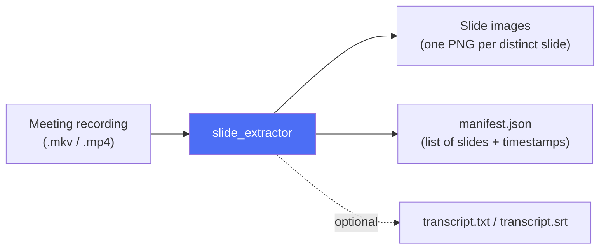
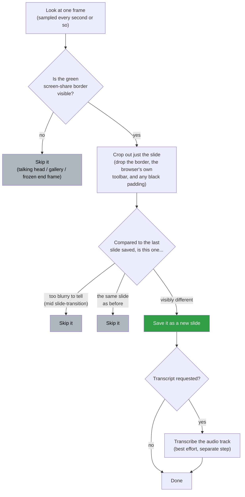

# meeting_recording_to_ppt

Extract unique presentation slides (and, best-effort, a transcript) from a
screen-recorded Zoom meeting video.

## How it works

**The big picture:** you point the tool at a recording; it hands back the
slides that were shown, one image each, plus (optionally) a transcript.
Everything else in this section is *how* it manages that.



To do that, it has to tell "a slide is showing" apart from "someone's talking
head is showing" and "this is the same slide as a second ago." It leans on a
quirk of Zoom recordings: Zoom draws a thin, bright green border around
whatever screen share is currently pinned/viewed on screen. That border is
present on every frame where a slide is being shared, and absent during
talking-head/gallery segments (Q&A, discussion, the frozen "meeting ended"
frame at the end) — so its presence alone tells the tool which frames are
worth looking at.

Zooming in on what happens to a single sampled frame:



See [ARCHITECTURE.md](ARCHITECTURE.md) for the module-level breakdown, the
CLI's call sequence, and why the border needs *span*-based detection rather
than a naive "bounding box of every green pixel" (short version: Zoom also
puts a small green border around the active speaker's face, and a naive
approach merges the two). The pipeline, in more precise terms:

1. Samples the video at a fixed interval (`--interval` seconds) via `ffmpeg`,
   streaming raw frames rather than writing thousands of temp images to disk.
2. For each sampled frame, looks for rows/columns whose green-pixel span
   covers a large fraction of the frame (`--min-box-frac`). This finds the
   real screen-share rectangle while ignoring Zoom's small green border
   around the active-speaker's video thumbnail (a naive "bounding box of all
   green pixels" would incorrectly merge the two when they're vertically
   adjacent — see `slide_extractor/detect.py` for the details).
3. Crops the frame to that box, insetting past the green border
   (`--border-inset-px`) and trimming the browser tab/address bar + Zoom's
   "You are viewing..." banner off the top (`--top-trim-px`). Any letterbox
   padding Zoom adds below the shared window is trimmed off the bottom too —
   its height is auto-detected per frame (it isn't constant, even within a
   single recording: it changes whenever a presenter's shared window size
   changes), by scanning upward from the bottom edge for solid-black rows.
   Pass `--bottom-trim-px` to override with a fixed value instead.
4. Rejects blurry mid-transition frames and near-duplicate slides using
   sharpness (Laplacian variance) and structural similarity (SSIM) checks,
   so each distinct slide is saved exactly once, regardless of how long it
   was on screen or how many times the sampler passed over it.
5. Saves each accepted slide as a PNG plus a `manifest.json` (index,
   timestamp, filename).
6. Optionally (`--transcript`) extracts the audio and transcribes it with
   `faster-whisper`, writing `transcript.txt` and `transcript.srt`.

Frames with no large green box (talking heads, gallery view, the freeze-frame
after the meeting ends) are skipped entirely — they never reach the crop or
dedup stage.

## Install

Core dependencies (`numpy`, `Pillow`, `scikit-image`) plus a working
`ffmpeg`/`ffprobe` on `PATH`:

```sh
pip install -r requirements.txt
```

Transcript support is optional and heavier (downloads model weights on first
use):

```sh
pip install -r requirements-transcript.txt
```

### One-shot setup + verification

`localPipeline.sh` creates/reuses a `.venv`, installs core, dev, and
transcript dependencies, runs the pytest suite with coverage, and smoke-tests
the CLI end-to-end against a small synthetically generated clip (so it never
depends on any private recording being present):

```sh
./localPipeline.sh
```

Useful flags: `--no-transcript` (skip the heavy optional dependency),
`--with-real-video` (also run the full pipeline against a real `.mkv`/`.mp4`
found in this directory, purely informational), `--report-dir PATH` (keep
logs, JUnit XML, coverage XML, and the summary instead of discarding them).
See `./localPipeline.sh --help` for details.

## Usage

```sh
python -m slide_extractor "bmvw_2026-07-14 10-00-57.mkv" -o slides_output
```

This writes `slides_output/slide_0001_t00012.0s.png`, `slide_0002_t...png`,
etc., plus `slides_output/manifest.json`.

Add a transcript:

```sh
python -m slide_extractor "bmvw_2026-07-14 10-00-57.mkv" -o slides_output --transcript
```

Re-run into the same directory (overwriting previous output):

```sh
python -m slide_extractor "bmvw_2026-07-14 10-00-57.mkv" -o slides_output --overwrite
```

## Tuning for a new recording

`--top-trim-px` and `--min-box-frac` depend on the screen resolution, browser
chrome height, and Zoom UI layout of a *specific* recording — they are not
universal constants (`--bottom-trim-px` is auto-detected by default and
usually doesn't need tuning). To tune for a new recording:

1. Run once with `--debug --overwrite` and a short `--interval` (e.g. `5`):
   ```sh
   python -m slide_extractor video.mkv -o slides_output --debug --interval 5
   ```
2. Inspect `slides_output/debug/raw_t*.png` — these are the *untrimmed* box
   crops (browser chrome still visible). Measure how many pixels from the
   top the actual slide content starts, and pass that as `--top-trim-px`.
3. Re-run without `--debug` for the full extraction.

Other knobs:

- `--ssim-threshold` (default `0.90`): lower = less sensitive to change
  (fewer, coarser-grained slides saved); higher = more sensitive (catches
  smaller content changes, but may split one slide's build-up animation into
  multiple saves).
- `--min-sharpness` (default `0.0005`): raise if blurry transition frames are
  slipping through as saved slides; lower if legitimate low-contrast slides
  are being skipped.
- `--interval` (default `1.0`s): smaller values catch short-lived slides but
  take longer to scan.

## Known limitations

- Detection relies entirely on Zoom's screen-share highlight border. A
  recording where the shared screen was never pinned/highlighted (so the
  green border never appears), or a different conferencing tool without an
  equivalent highlight, won't be detected by this tool as-is.
- `--top-trim-px`/`--min-box-frac` are recording-specific; see "Tuning"
  above.
- Transcript quality depends entirely on `faster-whisper`/the chosen model
  size; this is explicitly a secondary, best-effort feature and failures
  never block slide extraction.

## Tests

```sh
pip install -r requirements-dev.txt
pytest
```

Or use `./localPipeline.sh`, which does this (plus coverage reporting and a
CLI smoke test) in a throwaway/reusable `.venv`.

Unit tests for detection and deduplication run on synthetic in-memory
frames (no video needed). Integration tests (`test_video_io.py`,
`test_cli.py`) generate a tiny synthetic clip with `ffmpeg` at test time —
they're automatically skipped if `ffmpeg`/`ffprobe` aren't on `PATH`. No
test depends on the private recording itself.
