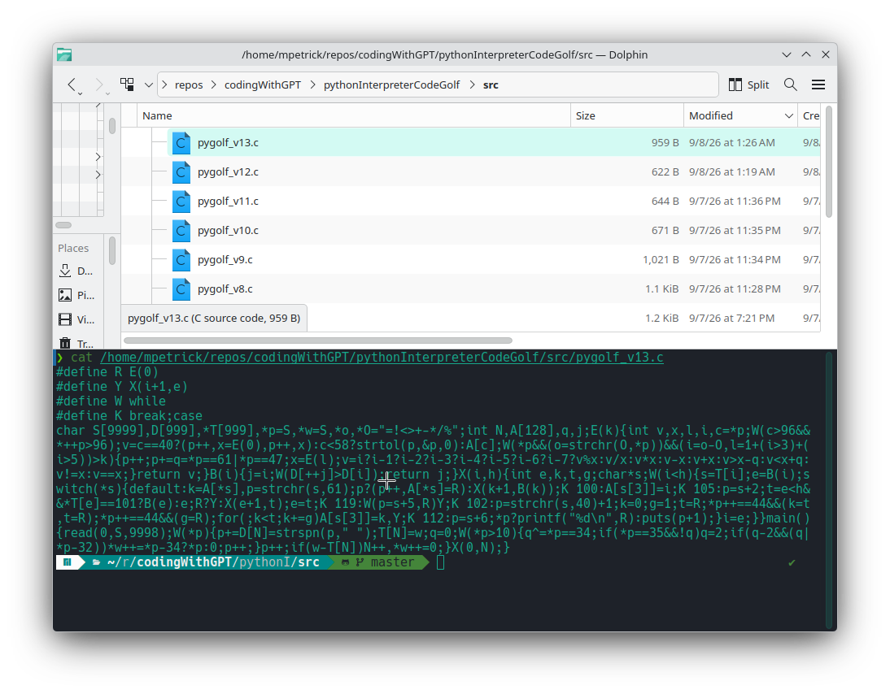

# pythonInterpreterCodeGolf

A Python interpreter written in C, then golfed down step by step.
Not a *complete* Python - a subset large enough to run real programs like the
FizzBuzz in [`program.py`](program.py), fed to the interpreter on stdin:

```sh
make && ./bin/pygolf < program.py     # 101 lines, byte-identical to CPython
```



The challenge came from a screenshot
([`input_python1024running.png`](input_python1024running.png)) of
**Austin Z. Henley**'s `python1024.c`: 1024 bytes of C that runs FizzBuzz
written in Python. He is a Principal Applied Scientist at Microsoft; his post
[Making a Python interpreter in 1024 bytes](https://austinhenley.com/blog/python1024.html)
(6 September 2026,
[Hacker News](https://news.ycombinator.com/item?id=49591876), 315 points) and
his source at [AZHenley/python1024](https://github.com/AZHenley/python1024)
are the prior art here.

Nothing in this repository is copied from it. Only the screenshot above was
known while writing this - the post and the source were read afterwards, to
compare. The design below was worked out from scratch and the golfing was done
one measurable step at a time.

**Result: 959 bytes for the full subset, 622 bytes for a FizzBuzz-only build.**

## Results

Every version is checked by `./run_tests.sh`, which diffs its output against
real CPython for each test program. v1-v9 and v13 run the whole subset
(6 programs); v10-v12 are deliberately reduced to what FizzBuzz needs
(1 program). Each version is one commit, so `git log` is the same ladder.

| Version | Bytes | Saved | Tests | What changed | What it cost |
|---|---:|---:|:--:|---|---|
| v1  | 9900 |     - | 6/6 | Readable reference: name table, error messages, comments | - |
| v2  | 2511 | -7389 | 6/6 | Mechanical shrink: no comments, one-letter names, `int` | readability |
| v3  | 2146 |  -365 | 6/6 | Loader normalizes the source; one precedence-climbing evaluator | - |
| v4  | 1636 |  -510 | 6/6 | Names keyed by first letter; keywords by one byte; no `#include` | names must differ in their first letter |
| v5  | 1509 |  -127 | 6/6 | Unary minus for free; merged symbol table; `printf`/`puts` | `'` strings, `\n` escapes |
| v6  | 1352 |  -157 | 6/6 | Unbounded block scan; folded loader state | - |
| v7  | 1244 |  -108 | 6/6 | Operator table drives precedence *and* operation; `switch`; macros | - |
| v8  | 1125 |  -119 | 6/6 | Global cursor instead of `char**`; `strtol`; K&R implicit `int` | - |
| v9  | **1021** |  -104 | 6/6 | Strings NUL-terminated at load; shared statement advance; layout | see limitations |
| v10 |  671 |  -350 | 1/1 | FizzBuzz-only: drops `while`, `range` steps, comments, parens, `<`/`>` | subset shrinks |
| v11 |  644 |   -27 | 1/1 | Final byte squeeze, one line | - |
| v12 |  **622** |   -22 | 1/1 | Narrower grammar `V [% V] [== V]`; every `if` must have an `else` | - |
| v13 |  **959** |  -62 vs v9 | 6/6 | Back to the full subset: `default` first in the switch so one macro carries `break;case `, `while` as a macro, ternary for `if`/`else`, atom folded into one expression | - |

Two lines run through the table. **v13 is the smallest version that still runs
the whole subset** - 9900 bytes down to 959, a factor of 10.3, with all six
programs still matching CPython byte for byte; v9 was the first to cross the
1024 line and v13 is where that line of work currently stops. **v12 is the
smallest that runs `program.py`** at 622 bytes, having given up features on
purpose to answer the other question - how little C can still interpret
FizzBuzz.

Byte counts are of the source file alone. No `-D` flags smuggle code onto the
compiler command line: every version builds with plain
`gcc -std=gnu89 -w`, the same way the screenshot's `python1024.c` was built.

## Prior art, and how this one differs

Same target, two different machines underneath. Henley's interpreter is a
recursive-descent parser that **executes directly off the source text** with no
intermediate form: a loop repeats by "jumping backwards and reparsing the
source each iteration", a function stores its position in the symbol table and
a call saves the caller's position, jumps there, and restores it afterwards.

This one keeps a **normalized line table** instead. One pass strips spaces and
comments and records each line's indent; after that a block is an *index
range*, a loop re-runs `X(i+1, e)`, and the C call stack carries the nesting.
Both of us landed independently on first-letter keyword matching, single-letter
identifiers, C89 implicit `int`, numeric character codes and ternary/comma
folding - convergent evolution, given the same compiler and the same target.

The subsets differ, so the byte counts are not a clean head-to-head:

| | python1024 (1024 B) | pygolf v13 (959 B) |
|---|---|---|
| `while ... else` / `for ... else` | yes | no |
| Recursive calls | yes | yes (verified) |
| `range(a, b, c)` | `range(y)` only | full |
| Parentheses in expressions | no | yes |
| `/` and `//` | no | yes |
| `!=` | no | yes |
| Truthiness of a bare integer | yes | yes |

His build is `gcc-16 -std=gnu89 -w` and GCC-only; so is this one.
Full notes, with sources and the trick-by-trick split, are in
[COMPARISON.md](COMPARISON.md).

A note on recursion, since it is the one place the two designs meet: a function
here may call itself, and

```python
def count():
    print(n)
    n = n - 1
    if n > 0:
        count()
    else:
        print("liftoff")
```

prints `3 2 1 liftoff` - but CPython *rejects* that program with
`UnboundLocalError`, because assigning `n` makes it local and it would need a
`global n`. Every variable here is global, so this is a genuine divergence,
not a subset: it is not in `tests/`, which only holds programs whose output
CPython agrees with.

## How it works, in four stages

### 1. Load

The whole program is read into one buffer with a single `read(0, ...)`.
No file handling, no line buffering.

### 2. Normalize into a line table

One pass rewrites the buffer in place and builds two arrays:

```
T[i] -> the text of line i, with every space outside a string removed
D[i] -> how many spaces that line was indented by
```

Blank lines and comments never enter the table, so an empty line can't cut a
block in half. Deleting the spaces is the single most valuable trick in the
whole program: after it, *nothing below ever has to skip whitespace*, and
keyword offsets become constants. `program.py` turns into:

```
D[]  T[]
 0   defbuzz():
 4   forninrange(101):
 8   ifn%15==0:
12   print("FizzBuzz")
 8   else:
12   ifn%3==0:
...
 0   buzz()
```

So `print(` is always `T[i]+6`, the condition of an `if` always starts at
`T[i]+2`, and a statement is recognised by its *first byte*: `d`, `i`, `w`,
`f`, `p`, `e`.

### 3. Execute a range of lines

There is no syntax tree. The line table **is** the tree, addressed by index
ranges: `X(lo, hi)` runs lines `lo..hi`, and a compound statement owns the
following lines indented deeper than itself:

```c
B(i)  /* first line after i's body */ { j=i; while(D[++j] > D[i]); return j; }
```

`if` runs `X(i+1, e)`; a `for` runs the same range once per iteration; `def`
just records its line number in the symbol table and skips its body; a call
looks that line up and runs its body. Recursion in the interpreter *is*
recursion in the interpreted program. Nothing is compiled ahead of time - a
loop body is re-scanned on every pass, which is slow and wonderfully small.

### 4. Evaluate expressions

One precedence-climbing loop over a global character cursor. An operator's
index in the string `"=!<>+-*/%"` gives both its precedence
(`1+(i>3)+(i>5)`) and which operation to apply - here with the character
literals spelled out, where the source uses their codes:

```c
while (*p && (o = strchr(O,*p)) && (i = o-O, l = 1+(i>3)+(i>5)) > k) {
    p++; p += q = *p=='=' || *p=='/';   /* the second byte of ==, !=, <=, //  */
    x = E(l);                           /* right side, higher precedence only */
    v = ... i-th operation on v and x ...
}
```

Because the recursive call passes `l` and the loop continues only while
precedence is *strictly* greater, operators stay left-associative.

## Golf tricks worth naming

- **Unary minus costs nothing.** The atom parser has no `-` case. Meeting one it
  consumes nothing and returns the variable slot `A['-']`, which no identifier
  can name and which is therefore always 0 - so the main loop reads the `-` as
  a *binary* operator and computes `0-x` by itself. (v8 onwards uses `strtol`,
  which swallows the sign directly and gets `2*-3` right as well.)
- **`<=` is `<` with a bump.** After an operator, one flag `q` says whether a
  second byte was skipped; then `v <= x` is `v < x+1` and `v >= x` is
  `v > x-1`, so four comparisons cost the code of two.
- **The closing quote is the terminator.** The loader writes a `\0` over every
  `"`. A `print` line then starts with `\0` exactly when its argument is a
  string, so `*p ? printf("%d\n", E()) : puts(p+1)` handles both cases.
- **Zeroed globals do the bookkeeping.** The indent array is 0 past the last
  line, so the block scan stops there without any bound check.
- **gnu89 gives types away.** `B(i){...}` is a function taking `int` and
  returning `int`, and `read`, `printf`, `strtol` need no `#include` at all.
- **`default` goes first in the switch.** Then every one of the five remaining
  labels is preceded by `break;case `, which becomes a single-letter macro -
  20 bytes for one reordering.

Published C-golf tip lists were checked against this code
([Codidact](https://codegolf.codidact.com/posts/282951),
[CodinGame](https://www.codingame.com/forum/t/tips-and-tricks-for-code-golfing-in-c/190897),
[Developer Insider](https://developerinsider.co/best-golfing-tips-and-tricks-in-c-programming-puzzles/)).
What actually paid here: `while` as a macro, `&&` in place of a single-branch
`if`, `a-b` instead of `a!=b`, implicit `int`, and `puts` over `printf`. The
interpreter design itself is not from them.

## The language

Supported: `def f():` and `f()` (no arguments, no return value) - `for v in
range(a[,b[,c]]):` - `while cond:` - `if cond:` / `else:` - `print(expr)` and
`print("literal")` - `v = expr` - integers, `+ - * / // %`, `== != < <= > >=`,
parentheses, leading `-` - `#` comments, blank lines, arbitrary nesting.

Not supported: arguments, return values, `elif`, `and`/`or`/`not`, strings as
values, lists, dicts, floats, imports, `break`/`continue`, local scope.

Limitations of the golfed versions (v4+), all deliberate:

- An identifier is its **first letter**: `total` and `t` are the same variable,
  and a function and a variable may not share a first letter.
- A statement is dispatched on its first byte, so a statement may not *begin*
  with an identifier starting `d`, `e`, `f`, `i`, `p` or `w`
  (`total = 1` is fine, `pos = 1` is not).
- Integer arithmetic only; `/` truncates like C, so `//` and `/` agree.
- Comparisons yield `1`/`0`, not `True`/`False`.
- Indentation must be spaces, line endings LF, identifiers lowercase.
- A `"` inside a `#` comment confuses the loader.
- Integer literals are read with `strtol(..., 0)`, so a leading `0x` or `0`
  would be taken as hex or octal - both are already illegal in Python 3.
- v10-v12 additionally drop `while`, `range` steps, parentheses, comments,
  assignment and every comparison but `==` - exactly what FizzBuzz needs - and
  v12 requires every `if` to have an `else`.

## Layout

```
program.py        the FizzBuzz that has to work
src/pygolf_v1.c   readable reference, fully commented - start here
src/pygolf_v13.c  the 959-byte full-subset version
src/pygolf_v12.c  the 622-byte FizzBuzz version, one line
src/pygolf_v*.c   all thirteen versions, one commit each
bin/pygolf        prebuilt v13  (x86-64 Linux)
bin/pygolf-min    prebuilt v12  (x86-64 Linux)
tests/            programs whose output must match CPython exactly
run_tests.sh      builds every version and diffs it against python3
```

```sh
./run_tests.sh          # the whole ladder
make                    # bin/pygolf and bin/pygolf-min
```

**Author: Marcel Petrick <mail@marcelpetrick.it>** - License: GPLv3 or later.
**Note: project is generated with AI.**
