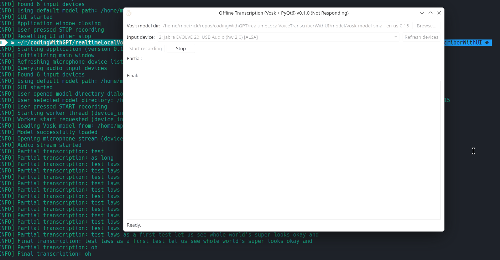

# draft implementation of a local, realtime voice transcriber (from audio to text)
* using right now the Vosk models; have to be downloaded from https://alphacephei.com/vosk/models

## test run with version 0.1.0
```
 python main.py          ✔  realtimeLocalVoiceTranscriberWithUI  
[INFO] Starting application (version 0.1.0)
[INFO] Initializing main window
[INFO] Refreshing microphone device list
[INFO] Querying audio input devices
[INFO] Found 6 input devices
[INFO] Using default model path: /home/mpetrick/repos/codingWithGPT/realtimeLocalVoiceTranscriberWithUI/model
[INFO] GUI started
[INFO] User opened model directory dialog
[INFO] User selected model directory: /home/mpetrick/repos/codingWithGPT/realtimeLocalVoiceTranscriberWithUI/model/vosk-model-small-en-us-0.15
[INFO] User pressed START recording
[INFO] Starting worker thread (device_index=2)
[INFO] Worker start requested (device_index=2)
[INFO] Loading Vosk model from: /home/mpetrick/repos/codingWithGPT/realtimeLocalVoiceTranscriberWithUI/model/vosk-model-small-en-us-0.15
[INFO] Model successfully loaded
[INFO] Opening microphone stream (device=2)
[INFO] Audio stream started
[INFO] Partial transcription: test
[INFO] Partial transcription: test test
[INFO] Partial transcription: test test test
[INFO] Partial transcription: test test test
[INFO] Partial transcription: test test test test
[INFO] Partial transcription: test test test test
[INFO] Partial transcription: test test test test
[INFO] Final transcription: test test test test
[INFO] Partial transcription: for
[INFO] Final transcription: for
zsh: IOT instruction (core dumped)  python main.py
```




## persisted settings for user-choices
```
   ~/.config/realtimeLocalVoiceTranscriptionWithUI  pwd                                                                                            ✔ 
/home/mpetrick/.config/realtimeLocalVoiceTranscriptionWithUI
    ~/.config/realtimeLocalVoiceTranscriptionWithUI  ls -lah                                                                                        ✔ 
total 12K
drwxr-xr-x  2 mpetrick mpetrick 4.0K Mar  4 16:34 .
drwxrwxrwx 67 mpetrick mpetrick 4.0K Mar  4 16:34 ..
-rw-r--r--  1 mpetrick mpetrick  147 Mar  4 16:34 settings.ini
    ~/.config/realtimeLocalVoiceTranscriptionWithUI     
```
