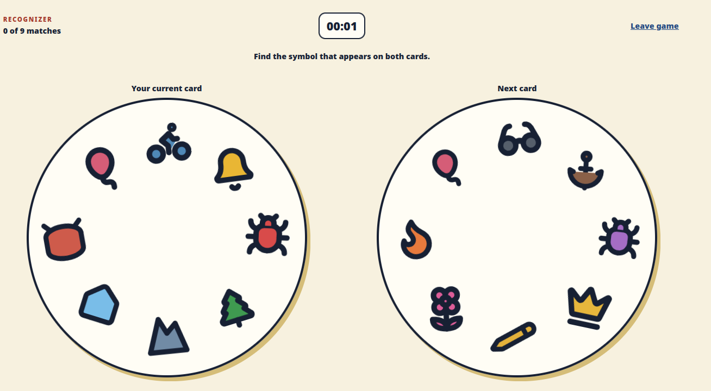
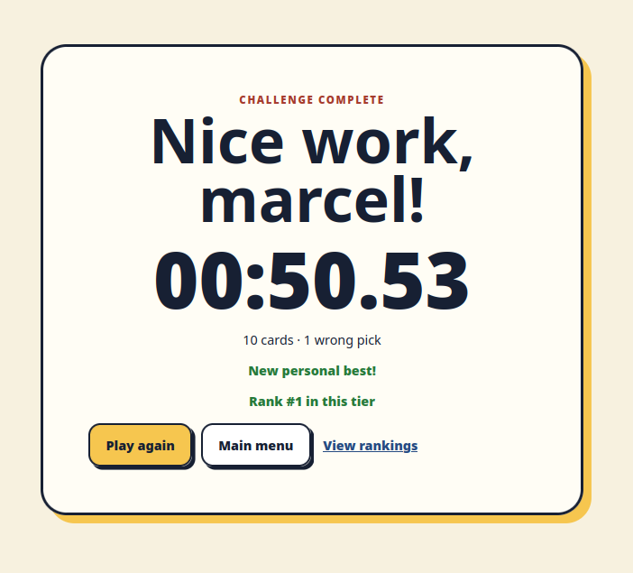
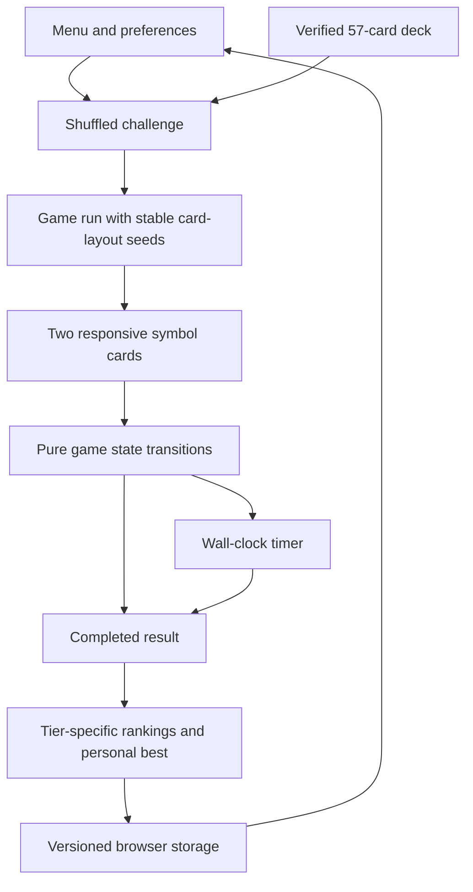
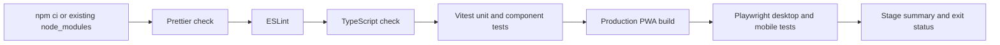

# Recognizer Game

Recognizer Game is a browser-based, single-player concentration game. Two cards are shown at a time, and every pair of cards has exactly one symbol in common. The player finds that symbol as quickly as possible while a wall-clock timer runs.

This document is the product specification for the MVP. It consolidates the original game discussion, the written requirements, and the stakeholder clarifications. Where earlier notes conflict with the decisions below, this document is authoritative.

**Author: Marcel Petrick <mail@marcelpetrick.it>**

**License: GPLv3 or later. See `LICENSE`.**

**Note: projected is generated with AI.**

## Product goals

- Create a quick-to-learn test of visual recognition, concentration, and adaptability.
- Support short, medium, and long sessions in a modern browser.
- Work well with mouse, touchpad, and touchscreen input.
- Preserve player preferences and local rankings between browser sessions.
- Use a playful, highly recognizable visual language.
- Keep the first release focused on a polished single-player experience.
- Avoid all user-facing references to existing commercial games, brands, or sources of inspiration.

## Core game loop

1. The player enters an optional display name and selects a 10-, 20-, or 50-card challenge.
2. The game selects that many distinct cards from the canonical 57-card deck and shuffles their order.
3. The first two cards appear and the timer starts immediately.
4. The player clicks or taps the one symbol shared by both cards. The matching symbol may be selected on either visible card.
5. A correct selection receives immediate feedback. The revealed stack card becomes the player's current card, and the next card is shown.
6. An incorrect selection shows a brief, non-blocking warning and may play an error sound. It does not add a time penalty, lock input, reveal the answer, or change the cards.
7. The loop continues until the final adjacent pair is solved.
8. The timer stops immediately, the result is saved locally, and the results screen compares it with the ranking for that challenge size.

## Game workflow

During a challenge, choose the shared symbol on either visible card. A correct selection advances the stack; an incorrect selection only gives a brief warning while the timer continues.



After the final match, the game freezes the wall-clock time, stores the result in the selected challenge tier, and reports personal-best and ranking feedback.



Challenge size means the total number of cards used in one game, including the initial current card. Consequently:

| Challenge | Total cards | Matching decisions |
| --- | ---: | ---: |
| Short | 10 | 9 |
| Medium | 20 | 19 |
| Long | 50 | 49 |

## Card mathematics

The canonical deck contains exactly 57 cards, with 8 distinct symbols on every card, drawn from a library of 57 distinct symbols. It is based on the finite projective plane of order 7:

- there are 57 symbols (points) and 57 cards (lines);
- every card contains 8 symbols;
- every symbol occurs on 8 cards;
- every pair of different cards shares exactly one symbol.

The generated card definitions are fixed, versioned data. Runtime randomization may change a symbol's placement, size, and rotation, but must never change card membership. Any subset of distinct cards retains the exactly-one-match property, so 10-, 20-, and 50-card games can be sampled safely from the full deck.

The deck generator and committed deck data must be verified automatically. Tests must assert the deck size, symbols per card, lack of duplicates within a card, symbol occurrence count, and exactly one intersection for every pair of cards.

## Symbol library and art direction

The library contains 57 immediately recognizable objects. The initial subjects are:

1. bird
2. tree
3. anchor
4. target
5. cheese
6. stone
7. ice cube
8. igloo
9. carrot
10. treble clef
11. star
12. moon
13. sun
14. crown
15. key
16. apple
17. mushroom
18. flower
19. fish
20. boat
21. bell
22. candle
23. heart
24. lightning bolt
25. umbrella
26. house
27. mountain
28. leaf
29. cup
30. clock
31. ladder
32. shell
33. balloon
34. cat
35. dog
36. turtle
37. butterfly
38. guitar
39. drum
40. hammer
41. magnet
42. rocket
43. airplane
44. train
45. bicycle
46. camera
47. book
48. pencil
49. snowflake
50. castle
51. boot
52. glasses
53. diamond
54. cloud
55. acorn
56. ladybird
57. compass

The list may change during the first visual iteration if testing reveals ambiguity, but IDs used by the card definitions must remain stable once results or released decks depend on them.

Each icon will be created specifically for the project, reviewed for visual quality, and stored in the repository as a reusable asset. A symbol has one canonical appearance everywhere in the game. Source artwork and production notes should also be versioned where available so replacements are intentional and reproducible.

The visual style is playful 1990s clip art:

- a thick, clean black outer outline;
- a bold silhouette and one dominant fill color;
- minimal internal detail;
- no photographic texture;
- no complex shadows;
- no gradient unless a subtle gradient is required for legibility;
- recognizable when small or rotated;
- distinguishable by shape, never by color alone.

Colors should be balanced across the library. For example, the tree is green, the anchor and treble clef may be brown, the carrot orange, the cheese yellow, and the ice cube light blue. Similar-colored icons must have clearly different silhouettes.

## Card presentation

Cards are circular or strongly rounded, with a clear edge, clean high-contrast background, and generous internal spacing. Their eight symbols form a loose, playful composition rather than a grid.

For each card rendering, the layout system may vary position, rotation, and size within controlled bounds. It must guarantee that:

- all eight symbols are fully inside the usable card area;
- symbols and their tap targets do not overlap;
- every symbol remains recognizable at its minimum size;
- no symbol dominates at its maximum size;
- touch targets remain comfortably selectable;
- rotation does not make the subject ambiguous;
- symbols are not mirrored;
- the layout remains usable on supported screen sizes.

The first version will use conservative, human-readable layout limits. Exact size, rotation, and spacing values are tuning parameters to be refined after playtesting. A deterministic layout seed should be available in development and tests so a problematic arrangement can be reproduced.

## Screens and states

### Main menu

The menu contains:

- game title and short timed-challenge description;
- optional player name with a reasonable length limit;
- clearly selected 10-, 20-, or 50-card challenge;
- start button;
- access to help;
- access to rankings;
- remembered name and preferences from the previous session.

If the name is empty, results are stored as `Player`.

### Help

Help uses short, nontechnical instructions and a visual example. It explains the one-shared-symbol rule, selecting on either card, card progression, challenge sizes, wall-clock timer, rankings, randomized layouts, and how to leave or restart.

### Preparing

The game selects and shuffles distinct cards, generates valid layouts, loads the required assets, and only then reveals the first playable pair. Preparation time is not included in the result.

### Active game

The screen shows:

- the player's current card;
- the next card from the stack;
- running timer;
- completed decisions, remaining decisions, and total;
- a progress indicator;
- leave and restart controls;
- an optional concise help reminder.

The two card roles must be visually clear. Input is briefly guarded during a successful transition to prevent double-processing.

### Completed and results

After the final correct match, input is disabled and the recorded time is frozen. The results screen shows the player name, challenge size, final time, ranking position when applicable, personal-best status, and actions to replay, view the ranking, or return to the menu.

Incorrect selections, average time per match, and fastest match may be recorded as secondary statistics, but elapsed time remains the only ranking criterion.

### Abandoned or restarted

Leaving or restarting requires confirmation because it discards the run. An abandoned run is never ranked. Restarting keeps the selected challenge size, resets progress and the timer, and selects and shuffles a new set of cards.

## Timer behavior

The timer measures elapsed wall-clock time from the moment the first playable pair appears until the final correct selection. It does not pause for tab changes, window minimization, device sleep, orientation changes, help, or loss of focus. The implementation must derive the display from timestamps rather than counting render intervals, so background throttling cannot make a run appear faster.

The active display shows at least minutes and seconds. Stored results use integer milliseconds; the result and ranking views may show hundredths of a second.

There is no pause function in the MVP because the stakeholder decision is that the timer never stops during an active run.

## Feedback and sound

A correct selection briefly highlights the shared icon on both cards and transitions immediately to the next pair. Animation should feel responsive and must not add meaningful forced delay.

An incorrect selection triggers a small warning beside the play area and a brief visual response on the selected icon. An optional error sound may play. The warning is non-modal, does not block further input, and disappears automatically. Repeated incorrect selections are allowed and have no effect other than elapsed wall-clock time.

The game is fully playable without audio. Sound has an on/off preference, defaults conservatively, and respects browser autoplay restrictions.

## Rankings and persistence

Rankings are local to the current browser and device. There are independent leaderboards for 10-, 20-, and 50-card games. Lower elapsed time ranks higher.

Each ranking:

- stores and displays the best 10 results;
- includes position, player name, time, and result date;
- permits duplicate player names and multiple entries by the same name;
- resolves equal times by first completed result first;
- shows placeholders when fewer than 10 results exist;
- reports whether a new result is ranked and whether it is a personal best for the exact display name and challenge size.

The same time-based rule is the benchmark: a result is compared only with results in its own challenge tier. No predefined percentile or global benchmark is part of the MVP. Because data is browser-local and editable by the device owner, rankings are casual feedback rather than cheat-resistant competition.

Local persistent data includes rankings, previously used player name, personal bests derived from results, sound/motion preferences, and selected challenge size. Stored data has an explicit schema version and is validated when loaded. The settings/ranking UI provides a confirmed action to clear all game data.

## Responsive design and accessibility

The MVP supports current desktop and mobile browsers, portrait and landscape layouts, mouse, touchpad, and touchscreen. On narrow screens cards may stack vertically; on larger screens they may sit side by side. Symbols and controls must remain legible and tappable in both arrangements.

Additional requirements:

- text and controls have sufficient contrast;
- visible focus states and semantic controls support keyboard navigation outside the visual matching task;
- accessible labels identify controls and status messages;
- color is never the only feedback or symbol distinction;
- nonessential motion can be reduced or disabled, including via `prefers-reduced-motion`;
- warnings are announced without stealing focus;
- the interface remains usable with sound disabled.

The symbol-matching interaction is primarily visual. Full nonvisual gameplay is not an MVP promise, but menus, settings, rankings, and game controls should use accessible web semantics.

## Recommended technical approach

Build the MVP as a TypeScript single-page web application using React and Vite. Use CSS for responsive layout and lightweight transitions, static generated image assets for symbols, and browser storage for rankings and preferences. A progressive web app manifest and service worker can make the built game installable and usable after its assets have been cached, without requiring a native application or backend.

Recommended supporting tools:

- Vitest for deck mathematics, state, ranking, persistence, and layout unit tests;
- Testing Library for component interaction tests;
- Playwright for critical desktop and mobile game flows;
- ESLint and Prettier for consistent source quality.

The domain logic should remain independent from React: deck construction, run state, time calculation, ranking insertion, persistence migration, and seeded card layout should be testable as pure TypeScript modules. This separation also leaves room for future multiplayer clients without putting networking concerns into the MVP.

## Architecture



The deck and game rules are pure TypeScript modules. React renders the menu, cards, timer, and result views around that state. Rankings and preferences are validated before being read from browser storage, so malformed local data falls back safely to defaults.

## Running and verifying the game

Install the locked dependencies and run the browser development server:

```bash
npm ci
npm run dev
```

The full local verification sequence is:

```bash
npm run format:check
npm run lint
npm run typecheck
npm test
npm run build
npm run test:e2e
```

Run every check through the local pipeline:

```bash
./localPipeline.sh
```

Use `./localPipeline.sh --install` after a fresh checkout, `--skip-e2e` when browser tests cannot run locally, and `--report-dir reports/local-pipeline` to retain per-stage logs and the final summary.



The production build includes a web app manifest and service worker. Once the app has loaded successfully, the browser can offer installation and serves the cached application shell and game assets while offline. Local rankings are browser storage, not part of the service-worker cache.

The rendered symbol system uses a fixed, catalog-complete vector mapping: every symbol has a stable silhouette, one defined primary color, and a dark outline. The catalog and its rendering coverage are automatically tested. See [REVIEW_AND_WORKFLOW.md](./documents/REVIEW_AND_WORKFLOW.md) for the architecture review, corrective priorities, and Mermaid workflows.

## MVP scope

The MVP includes:

- browser-based single-player play;
- the verified canonical 57-card deck and 57-symbol library;
- 8 symbols per card and exactly one common symbol per card pair;
- 10-, 20-, and 50-card challenges;
- shuffled subsets and collision-free visual layouts;
- wall-clock timer, progress, correct/incorrect feedback, and results;
- local rankings, personal bests, preferences, and data clearing;
- main menu, help, responsive game screen, and results views;
- mouse, touchpad, and touchscreen support;
- repository-owned generated icon assets;
- optional installable/offline browser mode after initial load.

The MVP does not include online accounts, global rankings, live multiplayer, tournaments, social integration, paid features, or cheat-resistant scoring. Multiplayer and tournaments are future concepts only.

## Acceptance criteria

The MVP is complete when:

- the application runs in supported modern browsers at desktop and mobile sizes;
- the player can enter a name and complete each challenge size;
- a challenge contains exactly the selected total number of distinct cards;
- every displayed card has eight symbols and each visible pair has exactly one shared symbol;
- automated tests verify the entire 57-card construction;
- randomized layouts keep every symbol visible, separate, recognizable, and selectable;
- selecting the shared symbol on either card advances exactly once;
- an incorrect selection gives non-blocking feedback and does not advance or penalize the score;
- the timer uses wall-clock time, stays visible, continues across focus loss, and freezes on the last match;
- leaving/restarting confirms and never saves an incomplete run;
- results are ranked by time in the correct tier, with equal times ordered first-come-first-served;
- rankings and preferences survive a page reload and browser restart;
- local data can be cleared only after confirmation;
- help accurately explains the implemented rules;
- the game remains usable without sound and with reduced motion;
- no user-facing text refers to an external commercial game or brand.

## Future direction

The domain model should allow later multiplayer and tournament work, but no networking or tournament UI is required now. A future multiplayer mode could present the same card pair to multiple players and award the round to the first correct response. Tournament formats could later build on those matches. Their identities, results, fairness model, synchronization, and rankings must remain separate from the local single-player timer.

See [IMPLEMENTATION_PLAN.md](./documents/IMPLEMENTATION_PLAN.md) for the proposed delivery sequence.
