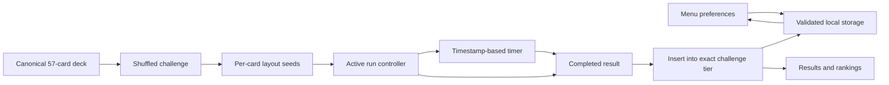
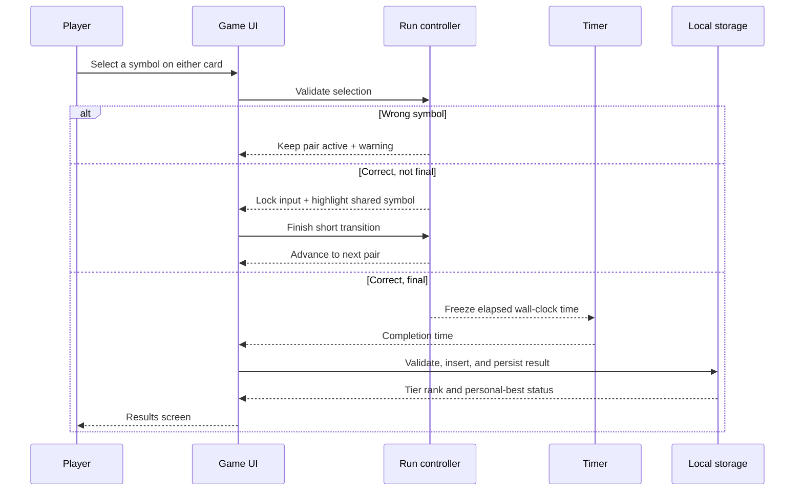

# Prototype Review and Delivery Workflow

Reviewed: 2026-07-14

The prototype proves the game loop and deck mathematics. It is not yet release-ready. The findings below are ordered by impact, with the first ten forming the corrective worklist.

## Prioritized findings

| # | Finding | Risk | Corrective action |
| --- | --- | --- | --- |
| 1 | Run state, timer ownership, and delayed transitions are coordinated inside `App`. A stale timeout can update a run after leaving or restarting. | Incorrect results or state updates after cancellation. | Introduce an explicit run controller/reducer, a transition token, and timeout cleanup. |
| 2 | Card layouts are derived from the visible position. A card changes its visual arrangement when it moves from the next-card role to the current-card role. | Unnecessary difficulty and a mismatch with stable-in-run card presentation. | Assign one layout seed to each card at challenge creation and retain it for the run. |
| 3 | The layout checks only circular visual bounds inferred from percentages. It does not reserve an independent hit area or use a deterministic fallback. | Tappable targets can crowd each other on small cards. | Model visual and hit bounds, use fixed safe slots as fallback, and test both. |
| 4 | No persistent preferences, rankings, migration, corrupt-data handling, or data clearing exist. | Scores and player choices disappear; browser data failures can break the UI. | Add versioned storage adapter, validation, recovery, settings, and confirmed clearing. |
| 5 | The completion screen does not store a result or show tier-specific ranking/personal-best feedback. | The primary motivating feedback loop is missing. | Add result insertion, tie ordering, top-ten ranking, and personal-best calculations. |
| 6 | Dependencies use `latest` ranges. | A clean install can change behavior without a source change. | Pin direct dependency versions and rely on the lockfile for transitive resolution. |
| 7 | Feedback preferences and reduced-motion handling are incomplete. | Users cannot control sound/motion; transitions are hard-coded. | Persist sound/reduced-motion preferences, add optional feedback tones, and remove motion when requested. |
| 8 | The initial artwork is incomplete: one reviewed bitmap asset exists while the rest use platform emoji. | Appearance varies by platform and does not meet the intended consistent clip-art style. | Keep the catalog contract, add reviewed canonical artwork in batches, and remove fallback glyphs before release. |
| 9 | Verification is limited to unit/component tests. | Browser-only issues, touch interaction, local-storage behavior, and installability are unproven. | Add Playwright desktop/mobile journeys and a production build smoke test. |
| 10 | The app lacks an installable offline shell and release-operation documentation. | The browser-installation requirement is unmet and handoff is unclear. | Add a manifest/service worker with tested update behavior and document deployment/playtest checks. |

## Correct game workflow

```mermaid
stateDiagram-v2
  [*] --> Menu
  Menu --> Help: open help
  Help --> Menu: return
  Menu --> Preparing: start selected tier
  Preparing --> Active: cards, layouts, assets ready; timer starts
  Active --> Active: wrong symbol / show non-blocking warning
  Active --> Transitioning: shared symbol selected
  Transitioning --> Active: next pair available
  Transitioning --> Completed: final pair resolved; timer freezes
  Completed --> Results: result is persisted and ranked
  Results --> Preparing: replay
  Results --> Menu: return
  Active --> Abandoned: confirmed leave/restart
  Abandoned --> Menu
```

## Data workflow

## Completion workflow

## Delivery rule

Each corrective action is committed independently with its tests. A change may not silently alter the canonical deck, challenge-size meaning, ranking tier, timer behavior, or selection rule. Review the icon batch and mobile card readability before declaring the artwork work complete.
