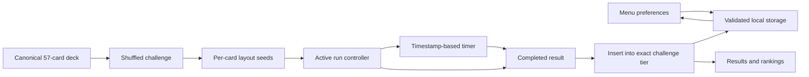
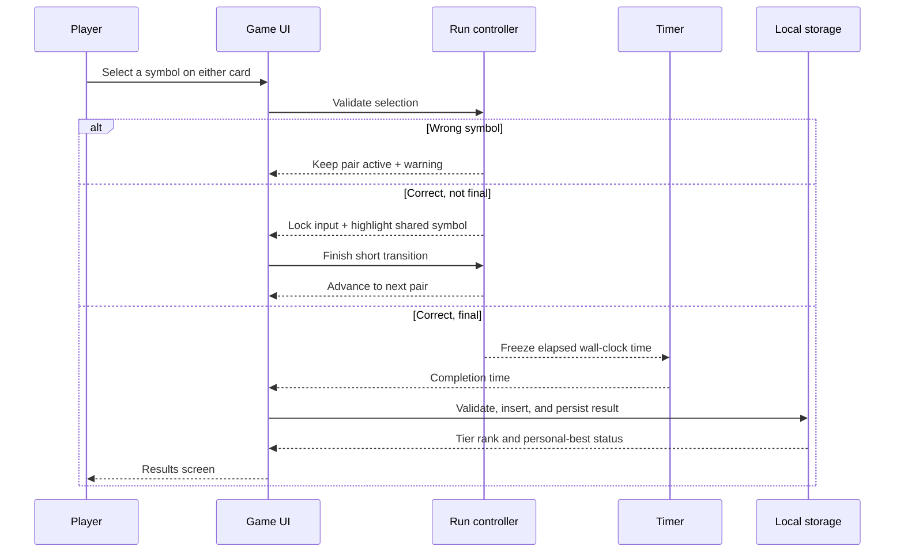

# Prototype Review and Delivery Workflow

Reviewed: 2026-07-14

The prototype proves the game loop and deck mathematics. It is not yet release-ready. The findings below are ordered by impact, with the first ten forming the corrective worklist.

## Prioritized findings

| # | Finding | Risk | Corrective action | Status |
| --- | --- | --- | --- | --- |
| 1 | Run state, timer ownership, and delayed transitions are coordinated inside `App`. A stale timeout can update a run after leaving or restarting. | Incorrect results or state updates after cancellation. | Transition session token and timeout cleanup. | Complete |
| 2 | Card layouts are derived from the visible position. A card changes its visual arrangement when it moves from the next-card role to the current-card role. | Unnecessary difficulty and a mismatch with stable-in-run card presentation. | Per-card seed assigned at run creation. | Complete |
| 3 | The layout checks only circular visual bounds inferred from percentages. It does not reserve an independent hit area or use a deterministic fallback. | Tappable targets can crowd each other on small cards. | Tested fixed safe slots with distinct visual and hit geometry. | Complete |
| 4 | No persistent preferences, rankings, migration, corrupt-data handling, or data clearing exist. | Scores and player choices disappear; browser data failures can break the UI. | Versioned storage adapter, validation, recovery, settings, and confirmed clearing. | Complete |
| 5 | The completion screen does not store a result or show tier-specific ranking/personal-best feedback. | The primary motivating feedback loop is missing. | Tiered insertion, tie ordering, top-ten ranking, and personal-best calculations. | Complete |
| 6 | Dependencies use `latest` ranges. | A clean install can change behavior without a source change. | Direct versions pinned and lockfile retained. | Complete |
| 7 | Feedback preferences and reduced-motion handling are incomplete. | Users cannot control sound/motion; transitions are hard-coded. | Persisted sound/motion settings, optional tones, and motion override. | Complete |
| 8 | The initial artwork is incomplete: one reviewed bitmap asset exists while the rest use platform emoji. | Appearance varies by platform and does not meet the intended consistent clip-art style. | Complete fixed vector mapping with catalog color and dark outline; no platform emoji at runtime. | Complete |
| 9 | Verification is limited to unit/component tests. | Browser-only issues, touch interaction, local-storage behavior, and installability are unproven. | Playwright desktop/mobile journeys, accessibility scan, and production build. | Complete |
| 10 | The app lacks an installable offline shell and release-operation documentation. | The browser-installation requirement is unmet and handoff is unclear. | Manifest, service worker, cache strategy, and operating guide. | Complete |

## Correct game workflow

```mermaid
stateDiagram-v2
  [*] --> Menu
  Menu --> Help: open help
  Help --> Menu: return
  Menu --> Preparing: start selected tier
  Preparing --> Active: cards, layouts, assets ready; timer starts
  Active --> Active: wrong symbol / show non-blocking warning
  Active --> Transitioning: shared symbol selected
  Transitioning --> Active: next pair available
  Transitioning --> Completed: final pair resolved; timer freezes
  Completed --> Results: result is persisted and ranked
  Results --> Preparing: replay
  Results --> Menu: return
  Active --> Abandoned: confirmed leave/restart
  Abandoned --> Menu
```

## Data workflow

## Completion workflow

## Delivery rule

Each corrective action is committed independently with its tests. A change may not silently alter the canonical deck, challenge-size meaning, ranking tier, timer behavior, or selection rule. Review the icon batch and mobile card readability before declaring the artwork work complete.
