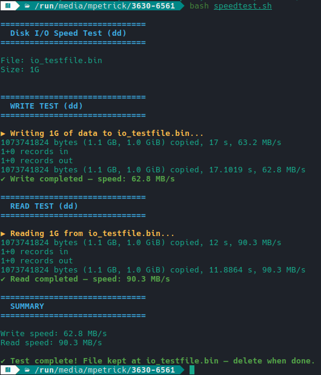

# Speed test for disks (sd cards) for reading and writing an arbitrary size

Invoke with
```bash
bash speedtest.sh
```

Give you some human-readable and eye-friendly results. Relies on `dd` by default.



## Note
* on FAT32-partitions obey the 4 GB limit

## License
GPLv3 - mail@marcelpetrick.it
