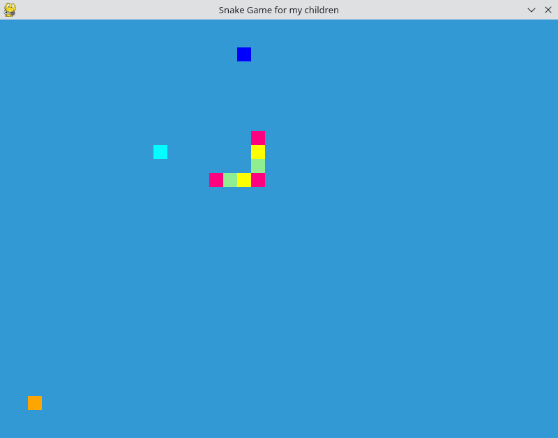

# Snake Game for Kids

## What is This?
The Snake Game for Kids is a delightful twist on the classic snake game, designed to be both fun and visually engaging for children. It features a **rainbow-colored snake** that navigates through a blocky, colorful world, growing as it eats randomly spawning fruits. These fruits appear in vibrant colors of orange, blue, and cyan, adding an element of surprise and excitement to the game. The simple yet charming blocky appearance of the game elements makes it appealing and accessible for young gamers.

## How to Configure the Setup
To get started with the Snake Game for Kids, you need to have Python 3.11 installed on your system. The game relies on the Pygame library, which can be installed via the `requirements.txt` file provided with the game. Follow these steps to set up the game environment:

1. Ensure you have Python 3.11 installed.
2. Clone or download the game repository to your local machine.
3. Navigate to the game directory in your terminal or command prompt.
4. Run the command `pip install -r requirements.txt` to install the necessary Pygame library.

## How to Run?
To start the game, follow these simple steps:

1. Open your terminal or command prompt.
2. Navigate to the directory where the game files are located.
3. Run the command `python snakeGameForKids.py` to start the game.

## Gameplay
Control the snake using the arrow keys:
- **Up Arrow**: Move the snake upwards.
- **Down Arrow**: Move the snake downwards.
- **Left Arrow**: Move the snake to the left.
- **Right Arrow**: Move the snake to the right.
- **Spacebar**: Temporarily double the snake's speed.
- **Enter Key**: Pause and resume the game.

The game ends when the snake collides with itself. Enjoy navigating the snake through a world of colorful fruits and rainbow segments!

## Author
Marcel Petrick (mail@marcelpetrick.it)

## Future improvements
* poppy tunes and sound effects when something is eaten
* configurable wall-elements (left out to prevent confusion)
