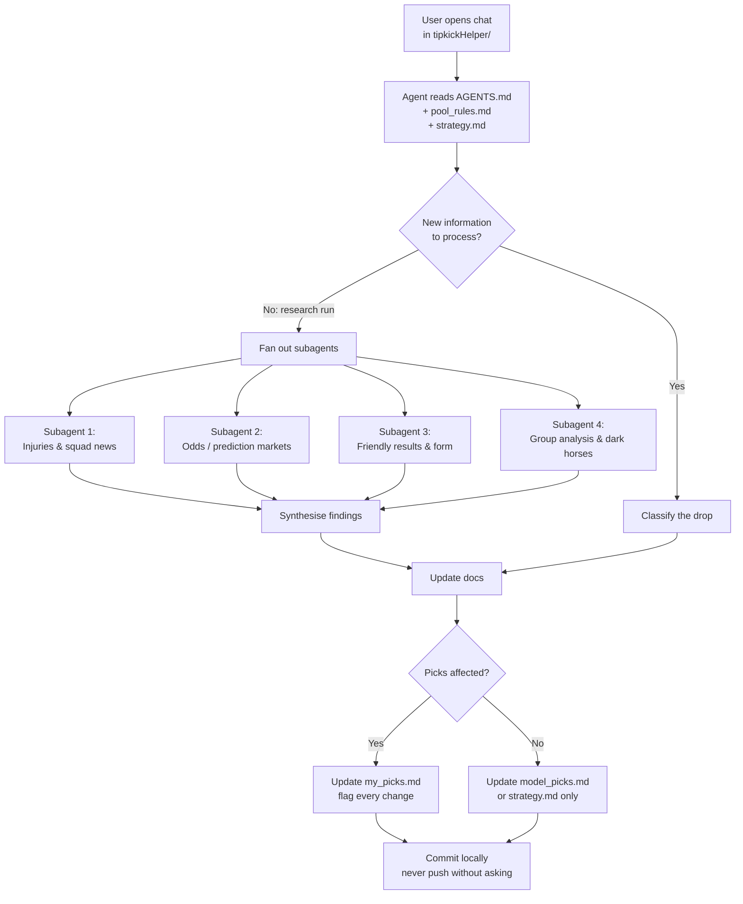
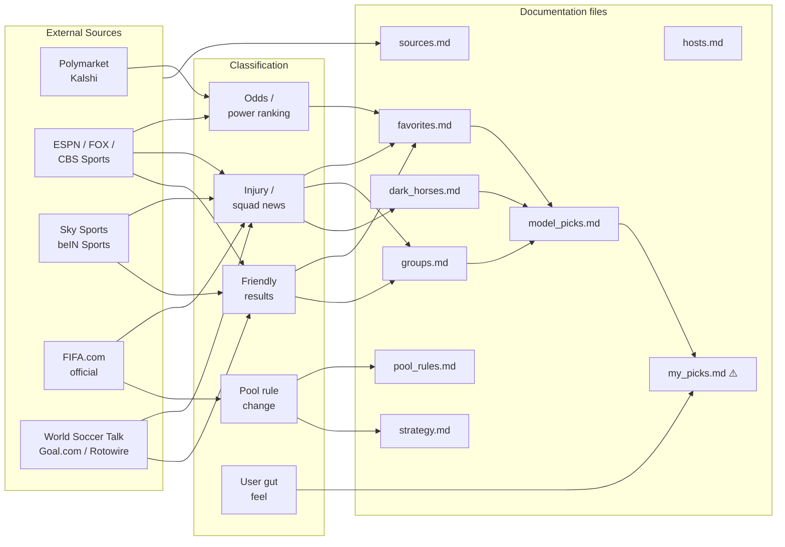
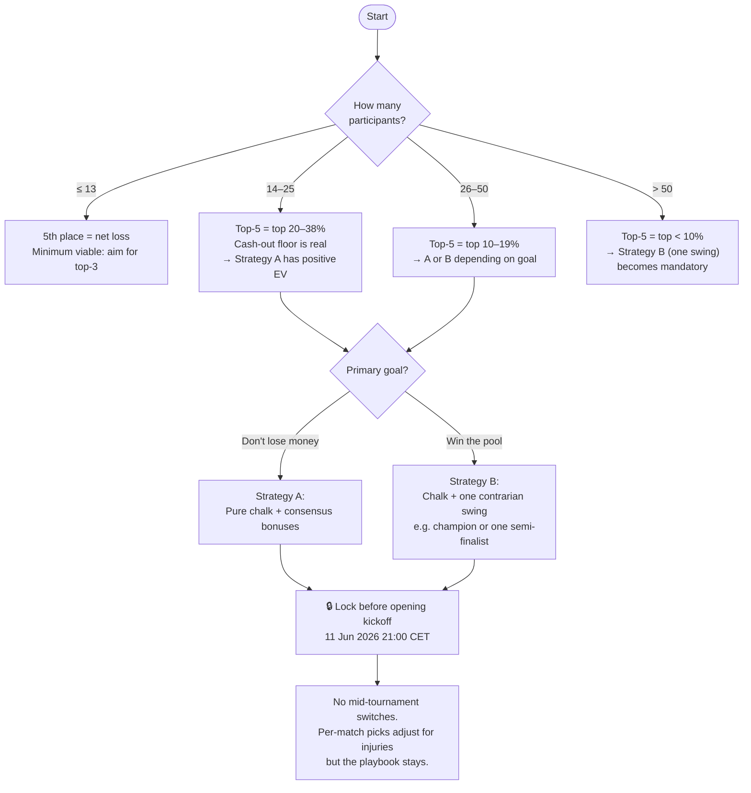
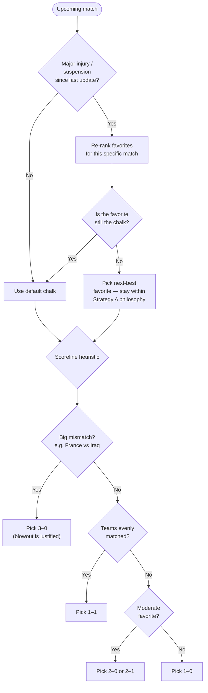
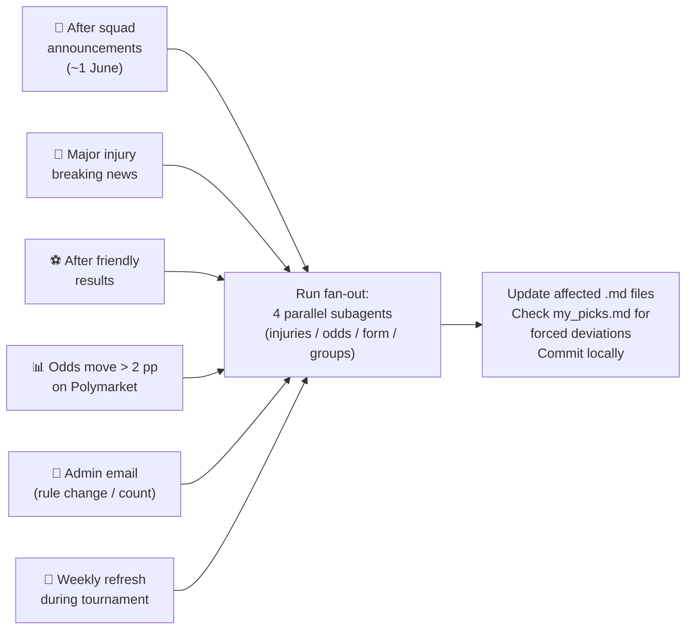
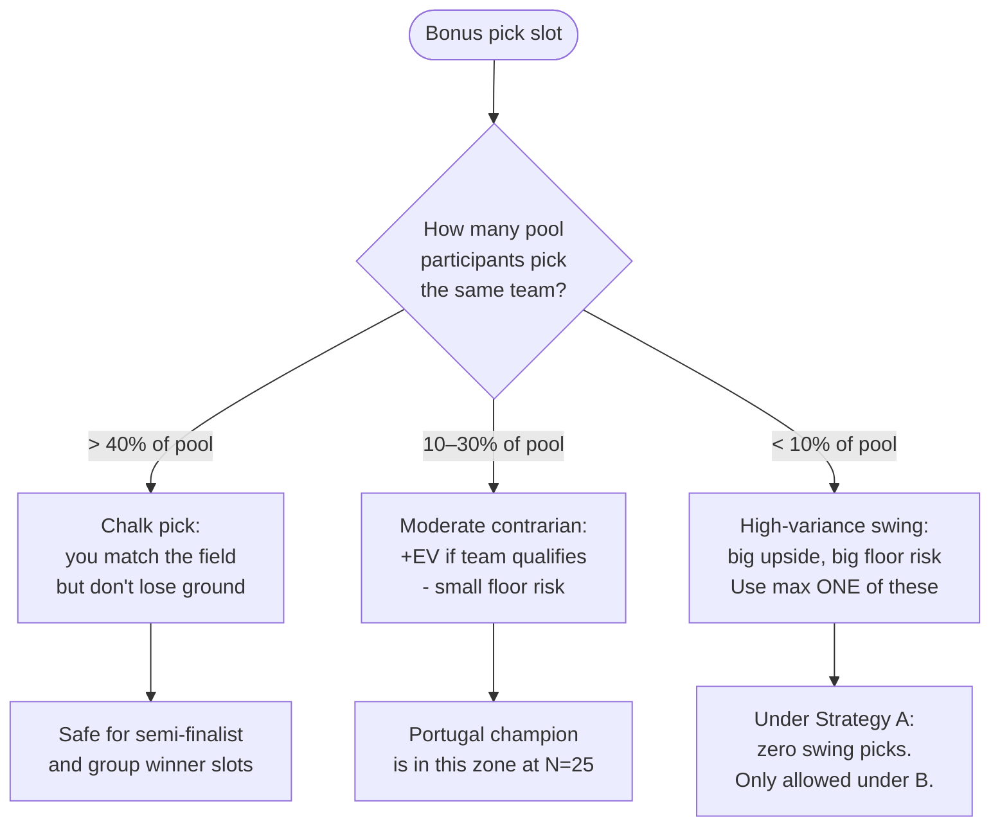
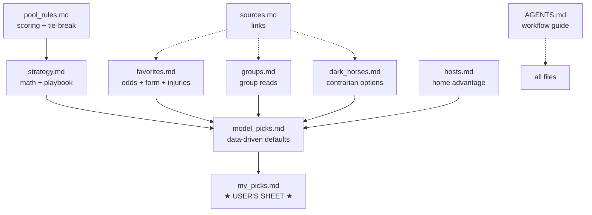

# How the Tipkick Helper Process Works

A reference diagram for anyone running the agent setup against this repo.
Run this process periodically — at squad-announcement time, after friendlies,
and whenever major injury news drops.

---

## 1 — Overall pipeline

---

## 2 — Data sources & where they flow

> ⚠️ `my_picks.md` is the only file the user fills in directly.
> Every agent edit to it must be flagged in the chat.

---

## 3 — Strategy selection logic

> Current pool: **25 participants** → Strategy A locked 2026-05-15.

---

## 4 — Per-match pick decision tree

---

## 5 — Agent research trigger checklist

When to run the fan-out research pass:

---

## 6 — Bonus pick EV logic

---

## 7 — File dependency map

---

*Last updated: 2026-06-02. Tournament: 11 June – 19 July 2026.*
