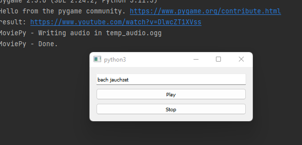

# What?
Wanted to write a music-player for random user-picked songs, where it fetches the content from youtube and plays it. Player has a gui with lineedit for search queries and a play and a stop button.

As expected GPT4 recommended to use PyQt, but then struggled to suggest a proper search-query (inserted manually), because the other two packages did not work (here in my constrained setup), then the fetch&play from youtube ran into similar issues. After lots of modified prompts and trial&error (quite annoying) I achieved a working version.

Weird is that the resulting *.webm-file from the download has to be converted to *.ogg, which results in a delay. But it works :)

# Result

# Why?
Starting point to create a visual front-end for the last.fm-scraper I wrote some years ago.